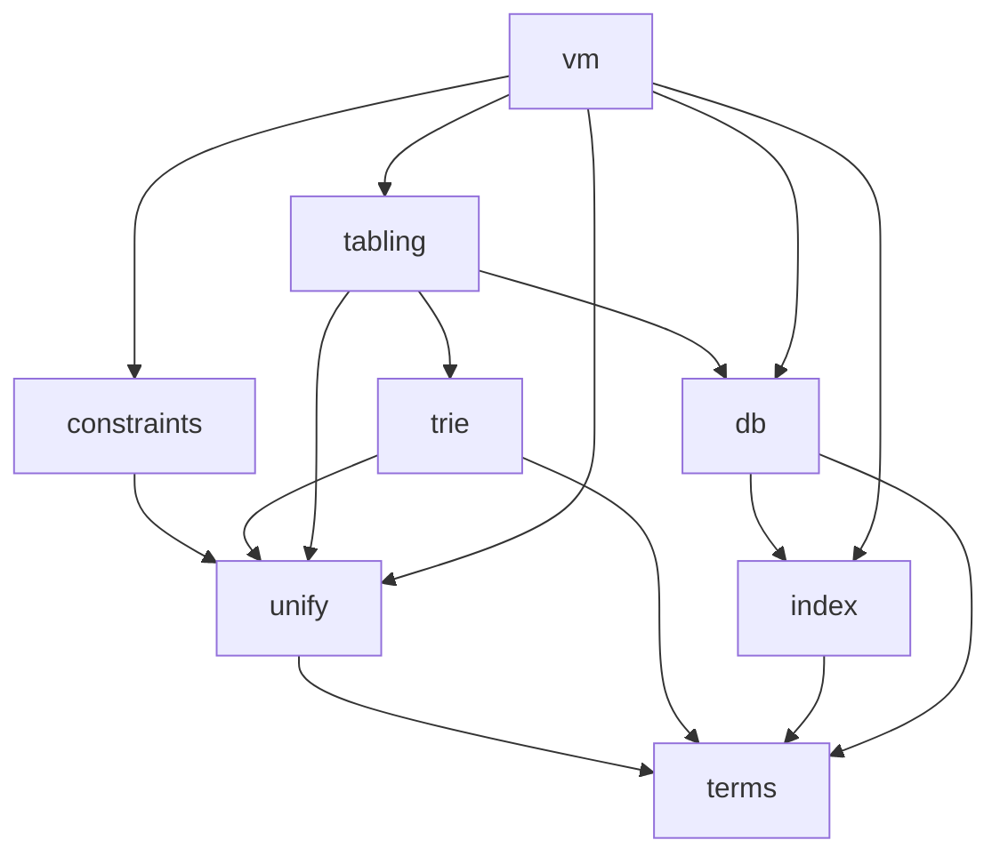

# LogicKernel architecture

## The layout mirrors swipl-devel

Decided 2026-10-02: LogicKernel is a **full mirror** of [swipl-devel](https://github.com/SWI-Prolog/swipl-devel)
(first priority) with [scryer-prolog](https://github.com/mthom/scryer-prolog) as the second reference,
so comparing with upstream — and tracking it commit by commit — stays a mechanical job.

| upstream | LogicKernel |
|---|---|
| swipl-devel `src/pl-prims.c` | `src/pl-prims.jl` |
| swipl-devel `boot/tabling.pl` | `boot/tabling.jl` |
| swipl-devel `tests/core_lang/test_bips.pl` | `test/core_lang/test_bips.jl` |
| swipl-devel `bench/programs/derive.pl` (the `bench` submodule, repo `swipl-bench`) | `bench/programs/derive.jl` |
| scryer-prolog `src/lib/tabling.pl` | `scryer-prolog/src/lib/tabling.jl` |

* A ported **file** lives at upstream's path; a ported **function** or **test unit** keeps upstream's
  name (`!` appended when it mutates an argument). Each carries a `# PORT:` marker.
* Code with **no upstream counterpart** opens with `# ORIGINAL: <why>` and lives in the nearest SWI
  area: `src/` for source, `test/<SWI tests area>/` for its tests, `test/` root for package
  infrastructure. It may never sit at a path that shadows an upstream file, and never in `boot/`.
* Directories exist only where swipl-devel has them.

`tools/port_check.jl` enforces every rule above in the suite (with a fixture proving each check can
fail), and the workspace hook `require-logickernel-port-header.sh` catches the common mistakes at
write time. The generated table in [`port_inventory.md`](port_inventory.md) lists every port;
`tools/upstream_drift.jl` reports what changed upstream since each one.

**Where Julia forces a different name** (the only deviations, each required by the language):

| swipl-devel | LogicKernel | why |
|---|---|---|
| `tests/` | `test/` | `Pkg.test` runs `test/runtests.jl` |
| `tests/test.pl` (driver) | `test/runtests.jl` | same |
| — | `src/LogicKernel.jl` | a package's entry file must be `src/<Name>.jl` |
| — | `ext/` | Julia package extensions |
| `doc/`, `man/` | `docs/` | Julia documentation convention |

## What is here now

| file | what | upstream |
|---|---|---|
| `src/term_interface.jl` | the term interface (ORIGINAL — settled 2026-10-02) | — |
| `src/pl-prims.jl` | the standard order of terms: `compareStandard` and its chain | `src/pl-prims.c`, `src/pl-incl.h` |
| `src/default_term.jl` | `Term{G}`, the reference implementation (ORIGINAL) | — |
| `test/core_lang/test_bips.jl` | SWI's own `ground/1`, `compare/3`, `==/2` tests | `tests/core_lang/test_bips.pl` |
| `test/core_lang/test_compare_swipl.jl` | live differential: `compare/3` on every pair vs `swipl` | — |
| `test/core_lang/test_term_interface.jl` | the conformance suite on the reference type | — |
| `bench/programs/{derive,nreverse,qsort,poly_10}.jl` | the STANDALONE CONSUMER: four of SWI's benchmark programs written on `DefaultTerm` with exported names only, beside the verbatim `.pl` files | swipl-bench `programs/*.pl` |
| `test/test_standalone_consumer.jl` | runs them: only exported names (checked by parsing), independent oracles, and identical `write_canonical` output to swipl running the upstream programs | — |
| `src/pl-index.jl` | just-in-time clause indexing, function by function: lookup, index creation, assessment, candidate indexes, the primary index, deep (list) indexes, the `indexed` property | `src/pl-index.c`, `src/pl-inline.h` |
| `src/pl-incl.jl` | the structs the clause store and its indexes are built from (`clause`, `clause_ref`, `clause_index`, `clause_list`, `definition`, …) and the word layout of keys | `src/pl-incl.h`, `src/pl-data.h` |
| `src/pl-comp.jl` | the head side of the clause compiler — variable analysis, `compileArgument`, the `H_VOID_N` merging — and the code readers the index uses (`skipArgs`, `argKey`) | `src/pl-comp.c`, `src/pl-comp.h` |
| `src/pl-vmi.jl` | the VM instructions heads compile to (declarations only) | `src/pl-vmi.c`, `src/pl-codetable.c` |
| `src/pl-proc.jl` | predicates and adding clauses (`lookupProcedure`, `assertDefinition`) — the slice the index needs | `src/pl-proc.c`, `src/pl-proc.h` |
| `src/pl-hash.jl` | MurmurHash2, for multi-argument keys | `src/pl-hash.c` |
| `test/db/test_jit.jl` | SWI's own JIT-indexing tests (`jit`, `jit_static`) | `tests/db/test_jit.pl` |
| `test/db/test_index_swipl.jl` | the indexing contract, LogicKernel#1's fix pinned, and a live differential: random programs give identical answers to swipl for every call, and identical determinism, indexes and primary indexes wherever the fix cannot apply | — |
| `test/compile/test_head_code_swipl.jl` | live differential: compiled heads are instruction-for-instruction swipl's `vm_list` | — |

## Subsystems — a grouping of upstream files, not directories

The kernel is built in this order; each subsystem is the set of SWI files it ports. An arrow reads
"depends on".

| subsystem | port class | swipl-devel files | notes |
|---|---|---|---|
| `terms` | design + code | `src/pl-prims.c` (standard order) | the interface is ORIGINAL; compounds are children with the head as child 1 |
| `unify` | code | `src/pl-variant.c`, `src/pl-termhash.c`, unification in `src/pl-prims.c` | variant checking, term hashing, renaming |
| `constraints` | code | `src/pl-attvar.c` | attributed-variable hooks |
| `trie` | code | `src/pl-trie.c` | answer and variant tables, variables keyed by first occurrence |
| `index` | code | `src/pl-index.c` | ported 2026-10-02, verbatim: keys are read from compiled head code as upstream reads them — with ONE deliberate divergence: `skipArgs`'s H_VOID_N defect is fixed ([LogicKernel#1](https://github.com/CognitiveSubstratesAI/LogicKernel/issues/1)), so an argument right after `_,_` is indexed where swipl 10.1.16 does not; see the contract below |
| `db` | design | `src/pl-proc.c` | clauses in source order, generations (logical update view), clause GC |
| `tabling` | code (WFS) | `src/pl-tabling.c`, `boot/tabling.pl`; scryer `src/lib/tabling.pl` | SLG: suspension, SCC completion, WFS delays; scryer's is the delimited-control design |
| `vm` | design | `src/pl-comp.c`, `src/pl-wam.c` | SWI is ZIP-based, not the WAM; compiled clauses decompile back to terms. The head side of pl-comp.c is ported (for the index); bodies and the instructions' execution are not |

## Invariants every subsystem keeps

1. **Indexing never changes answers.** Any narrowing yields a superset; enumeration yields exactly
   the true multiset, in source order. A flag that disables narrowing must disable EVERY narrowing.
   SWI's deep (list) indexes keep this by construction, so the port needs no extra step:
   `addClauseBucket` puts a variable clause into EVERY functor's clause list and starts each new
   list with the variable clauses already there, and `addClauseToIndex` refuses a variable clause
   into a list index (the index is dropped instead). An earlier note here, written before
   pl-index.c was read in full, claimed the opposite (corrected 2026-10-02).
2. **A grounded key follows `==`.** Where `==`, `isequal` and `hash` cannot be guaranteed to agree,
   the key is `nothing` — a wildcard, never a shared bucket. `gnd_equal` is the only grounded
   comparison in the kernel.
3. **Answers in order, duplicates kept.** Deduplication and tabling modes are caller options.
4. **No module-level mutable state** (`tools/lint_globals.jl`, run by the suite).
5. **No runtime dispatch, no abstract fields, no `Any`** — enforced by the suite with JET, Aqua,
   AllocCheck and the type-discipline gates; every method must be in the dispatch manifest.
6. **No choice points, no trail.** Nondeterminism is sink/continuation with an explicit stack.
7. **Standalone.** No dependency on any CognitiveSubstratesAI package.

## Still to come

* ✅ **The standalone consumer** — done (four swipl-bench programs, above). It found a real gap on
  the way: a client could not read a symbol's NAME or a grounded VALUE through the public API, so
  `Term{G}` gained `sym_name` and `gnd_value` (the interface rightly has neither — the kernel never
  needs them). Each new subsystem extends the consumer with what it makes possible.
* **The rest of `db`** — retract, clause/2, generations (the logical update view), clause GC — and
  with it test_jit.pl's units `remove` (the second), `retract`, `retract2`, `clause`, and the
  pl-index.c functions that serve them (`deleteActiveClauseFromIndex`, `cleanClauseIndex`, …).
* **The canonical-encoding property** — the kernel's variant key of a term equals MORK's De Bruijn
  bytes for it. It arrives with variant canonicalisation (`unify`) and a PathMap extension.
