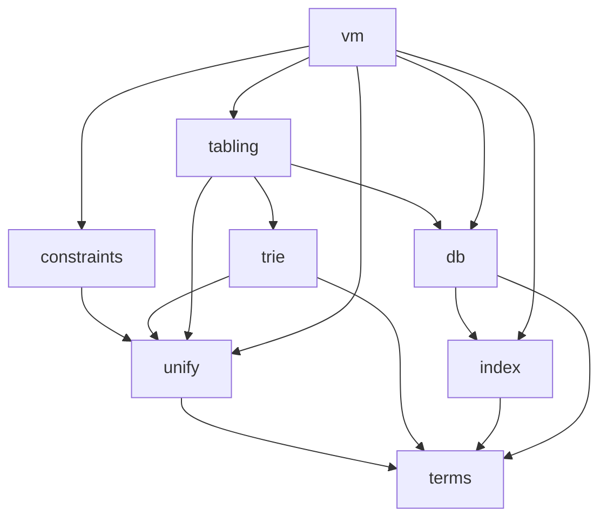

# LogicKernel architecture

## Subsystems and their dependencies

Each subsystem is one directory under `src/` with one entry file, `src/<subsystem>/<subsystem>.jl`,
included from `src/LogicKernel.jl` in the order below. An arrow reads "depends on". A subsystem may
use only what is upstream of it; nothing depends on `vm`.

**Include order:** `terms` → `unify` → `constraints` → `trie` → `index` → `db` → `tabling` → `vm`.

| subsystem | what | port class | upstream (SWI-Prolog) |
|---|---|---|---|
| `terms` | the term interface, the default term type, standard order (derived) | design (settled 2026-10-02) | — |
| `unify` | unification, bindings, substitution, renaming, variant check, term hashing | code | `pl-variant.c`, `pl-termhash.c` |
| `constraints` | attributed-variable hooks | code | `pl-attvar.c` |
| `trie` | term tries: answer and variant tables | code | `pl-trie.c` |
| `index` | JIT argument index, discrimination trie, grounded key, deep key | code (assessment) + design | `pl-index.c` |
| `db` | definitions, clauses in source order, generations, clause GC | design | `pl-proc.c` |
| `tabling` | SLG: suspension, SCC completion, WFS delays, answer modes | code (WFS) | `pl-tabling.c`, `boot/tabling.pl` |
| `vm` | clause compilation, instructions, frames, the execution loop | design | `pl-comp.c`, `pl-wam.c` |

## Invariants every subsystem keeps

1. **Indexing never changes answers.** Any narrowing yields a superset; enumeration yields exactly
   the true multiset, in source order. A flag that disables narrowing must disable EVERY narrowing,
   or the differential comparing narrowed with unnarrowed is blind to the one it leaves on.
2. **A grounded key follows `==`.** Where `==`, `isequal` and `hash` cannot be guaranteed to agree,
   the key is `nothing` — a wildcard. `gnd_equal` is the only grounded comparison in the kernel.
3. **Answers in order, duplicates kept.** Deduplication and tabling modes are caller options; the
   kernel never imposes MeTTa's or Prolog's answer semantics.
4. **No module-level mutable state** (`tools/lint_globals.jl`, run by the suite).
5. **Concrete types in hot loops.** Every term-interface function returns a concrete type and is
   defined on the concrete term types. No `Any`-typed containers.
6. **No choice points, no trail.** Nondeterminism is sink/continuation with an explicit continuation
   stack. SWI-Prolog is ZIP-based (not the WAM), and its compiled clauses decompile back to source
   terms, which this kernel also needs: clauses stay queryable as terms.
7. **Standalone.** No dependency on any CognitiveSubstratesAI package.

## Sequence

1. Skeleton — this layout, the suite, CI, the module-state lint. **(0.1.0)**
2. `src/terms/` — the interface, the default term type, the conformance suite, the standalone
   consumer's first form.
3. `src/index/` — argument indexing, with its differential (indexed vs unindexed enumeration must
   give the same multiset in the same order).
4. The deep key, inside this package — two levels, lazy level 2, built as already designed.
5. The remaining extractions, in port-inventory order, each with upstream's tests and a live `swipl`
   differential.
