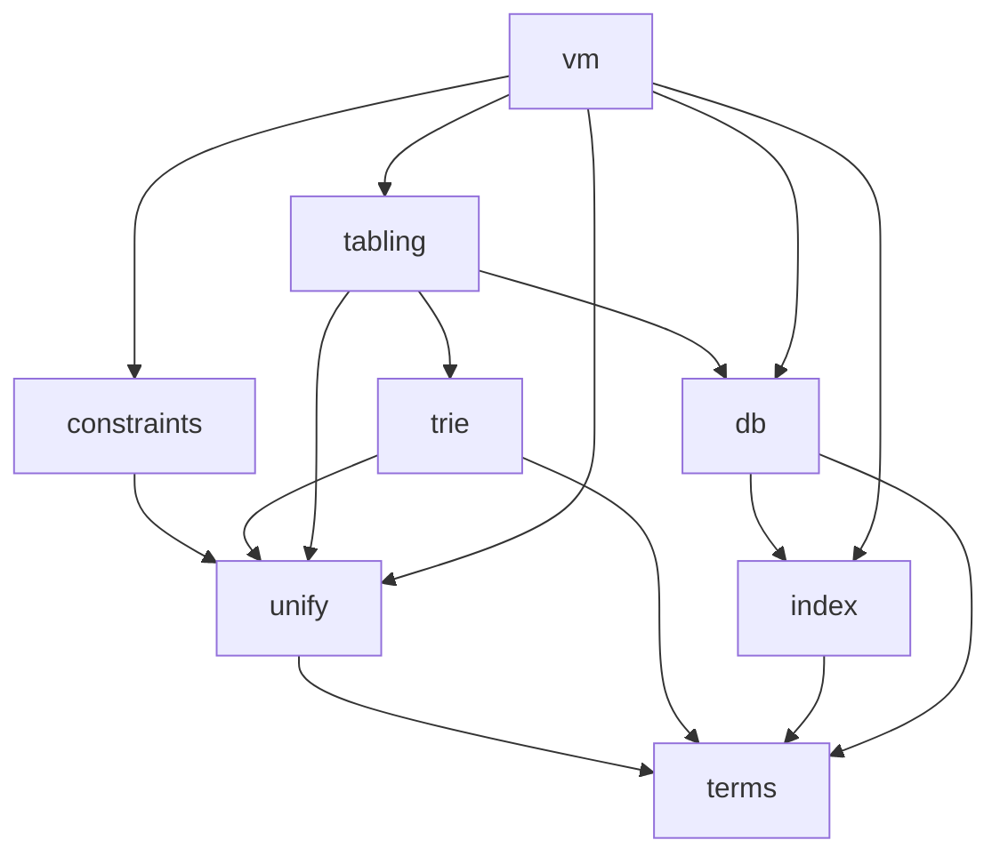

# LogicKernel architecture

## The rulebook: swipl-devel, as is

Decided 2026-10-03 (user): **LogicKernel follows swipl-devel as is — its logic, its data structures,
its semantics.** Where SWI uses a mechanism, the kernel uses that mechanism; a departure is a
`# DIVERGES:` with its reason, never a design preference. Two consequences that differ from Core:

* **Bindings use SWI's trail with marks.** Unification binds in a mutable binding store and records
  each binding on a trail; `Mark` before an attempt, `Undo` back to it afterwards — `pl-prims.c`'s
  `do_unify` and `pl-wam.c`'s `do_undo`, under upstream's names. The workspace's execution rules
  (sink/continuations, no choice points, no trail) govern **Core**, not the kernel's internals.
* **Grounded values unify by SWI's identity, not by `==`.** In the reference term type, `1 = 1.0`
  fails, `0.0 = -0.0` fails (floats compare by bit pattern), and a NaN unifies with an identical NaN.
  MeTTa's `==` matching belongs to Core's implementation of the term interface, which supplies its own
  `gnd_equal`/`gnd_key` — the separation the interface exists for.

## Commit messages follow SWI's categories

Decided 2026-10-03 (user), from that date on (history is not rewritten). Every commit message starts
with a category, as SWI-Prolog's history does, so the history can generate a changelog and match
ports against upstream:

* `ADDED:`, `FIXED:`, `ENHANCED:`, `MODIFIED:`, `DOC:`, `TEST:`, `CLEANUP:`.
* `UPSTREAM:` for a commit that ports or syncs code from swipl-devel (or scryer-prolog, swipl-bench).
  It names the upstream file(s), the functions and the upstream commit, e.g.
  `UPSTREAM: pl-wam.c PL_open_query/PL_next_solution (swipl-devel bae881a2)`. It is never `PORT:`,
  which in SWI means a platform port.

**Enforced by git itself** (since 2026-10-03): `tools/githooks/commit-msg` refuses a message without a
known prefix. Git hands it the final message file however the message was supplied, and it applies to
every committer. Install it once per clone with `git config core.hooksPath tools/githooks`;
`tools/run_tests.sh` refuses a full run without it. Its contract, both sides, is
`test/test_commit_msg_hook.jl`. It replaces a workspace-side check of the command text, which is now
retired.

## A full run of `tools/run_tests.sh` is the commit gate

Besides the suite, a FULL run first refuses to start unless:
* the commit-msg hook above is installed;
* the tree is Blue-formatted, checked as CI's Format job checks it (`format(".")` without writing),
  with the JuliaFormatter version CI pins — read from `.github/workflows/CI.yml`, so the two cannot
  drift.

So a formatting slip stops the commit locally instead of turning CI red afterwards. A single-file
run (`tools/run_tests.sh test/x.jl`) is for iteration and skips both checks; it is never evidence.

**The warm lane is for iteration, never evidence (user, 2026-10-03).** `tools/warm.sh` keeps one
daemon with LogicKernel loaded under Revise (`tools/warm_session.jl`) for single files on every term
implementation, mutation proofs, the bench and probes. A long-lived process is where state leaks
hide — values of a type's old layout, test residue, an update that failed partway (in Core a
setting left off in a daemon faked a green result, and a polluted daemon made a bisect name the wrong
file) — so evidence is a process that started clean. The daemon follows Revise's own documentation:
* it starts from the last precompile cache and revises it to the source (`Revise.stale_load`),
  instead of re-precompiling; revision is manual (`JULIA_REVISE=manual`), before every snippet;
* a struct edit needs no restart (Julia ≥ 1.12 redefines types); the second implementation is
  tracked in `:eval` mode, so its structs and constants revise too;
* an edit to a file defining a macro, a `@generated` function or a type alias (`const Clause{T} =
  clause{…}`) re-evaluates the whole module, which Revise would not propagate otherwise;
* a failed update, a queued Revise error or a cache rewritten by another process REFUSES the
  snippet; snippets run through `invokelatest`; Revise's audit trail (`debug_logger`) is reported
  with every snippet, and a `src/` Revise is not watching refuses the daemon's start;
* `start` PRECOMPILES the current source into the daemon's depot first (no daemon is running then,
  so no cache can be refused), and `stale_load` starts from a cache that IS the source. Evidence
  compiles elsewhere, so that cache had only aged: measured, a start revised 445 methods;
* the static-analysis gate's method walk counts only methods CURRENT in this world
  (`_current_method`): since Julia 1.12 a redefined method stays in the table with its world range
  closed, and a revised daemon showed every one of them as "NOT CHECKED" (a control pins it);
* a checkout COPY (parallel mutation proofs) runs its own daemon with `LOGICKERNEL_WARM_DEPOT`: a
  depot of its own and a normal load, since `stale_load` would take the original's cache and watch
  ITS `src/` (the "not watching" guard refused exactly that, measured);
* **`tools/warm.sh preflight`, before every full run (user, 2026-10-04: "do not waste time on cold
  starts"):**
  * the fast checks fail fast: Blue formatting, as CI checks it, and `port_check`;
  * then, while the evidence workers pre-warm for the tree (`pool`): the static-analysis gate (26 s
    warm, against ~200 s in a cold worker) and every test file changed since HEAD, on every
    implementation.
  MEASURED the day it was built: two of three cold runs (~11 min each) had failed on exactly those
  checks, port_check and JET;
  * **it RECOVERS from a stale daemon** (user, 2026-10-04: "make the gate recover, not just
    detect"). Revise can leave a deleted method alive in the daemon: Julia's method table keeps it,
    and the manifest gate's live-method filter (`which(m.sig) === m`) cannot tell it from a live one,
    so the gate reports it NOT CHECKED. That is a daemon condition, not a code failure: evidence
    runs are fresh processes and never see it (measured in V1 L2: `_decompiled!`).
    * Each NOT CHECKED name is classified from the SYNTAX TREE of every file under `src/`
      (port_check's `definitions`): STALE when no file defines it, REAL otherwise.
    * When that gate's coverage test is the preflight's ONLY failure and every name is STALE, the
      daemon restarts and the preflight reruns ONCE. The rerun's verdict is the verdict; a failure
      after the restart is reported REAL.
    * It never suppresses a NOT CHECKED: the only way to pass is a clean rerun in a fresh daemon.
      Any other failure, or a REAL name, fails at once, with the names classified;
* evidence processes compile into their own depot, `.warm/evidence-depot`, ahead of the user's
  (`_evidence_depot_path`; a bare trailing `:` would DROP `~/.julia`, measured). So a precompile for
  evidence never rewrites the cache the daemon loaded — which the daemon rightly refuses to revise
  past — and the pool warms while the daemon works;
* the daemon starts only under the PINNED swipl (tools/SWIPL_VERSION), checked in the daemon itself
  (`tools/swipl_pin.jl`); it runs with its caller's PATH, as a systemd service would otherwise start
  from systemd's own (see the evidence run below);
* the include list of src/LogicKernel.jl stays LITERAL `include("…")` lines: Revise notices a removed
  include only for a literal path (any generated list, M1's included, must write literal lines).
`tools/test_warm.sh` tests all of it (the preflight fails fast on a planted port_check violation,
fails BY THE TEST'S OWN VERDICT on a planted failing changed test file, and passes on the tree as it
is). Its stale-daemon cases go both ways:
* a daemon-only method is STALE, and the restarted rerun PASSES;
* a method loaded from source under a name no syntax tree shows (`@eval` of a built name) is
  classified STALE, but still fails after the restart, so it is REAL;
* a method defined in source by name is REAL at once, with no restart.

The verdict, Revise's refusal, Revise itself, the daemon's pin check and the PATH it is given are
mutation-proved.

**Evidence: a SHARDED run in fresh processes (user, 2026-10-03).** The suite is single-threaded and
this machine's CPU is old (a 2012 i7-3630QM, 4 cores): a full run took 10–16 min on one core, 2m44s
in CI. A full `tools/run_tests.sh` now splits it across fresh worker processes (`tools/worker.jl`,
count from cores and memory — 3 here; `LOGICKERNEL_SHARDS` overrides, `=1` the old single process):
* a unit is one test file on one term implementation; workers CLAIM units, costliest first, by an
  atomic `mkdir` in a directory made fresh for the run (`.evidence/<run id>/`), so they balance
  themselves and a killed run's claims can never make a later one skip units;
* each worker logs the exact sequence it ran; `LOGICKERNEL_REPLAY=.evidence/<run>/seq_<k>.tsv
  tools/run_tests.sh` replays one in order, in one process — never evidence;
* one precompile before any worker; workers run with `JULIA_PKG_PRECOMPILE_AUTO=0`;
* workers never load Revise, run once, and REFUSE a run whose tree fingerprint differs from the one
  they started with; `tools/warm.sh pool` pre-warms them for the current tree;
* each worker USES JET and AllocCheck once on a function of no package before it reports `ready`:
  their own compilation (18.7 s in a fresh process, measured) is then paid while the worker waits in
  the pool, not inside the timed run; nothing of LogicKernel is analysed early;
* 🔴 each worker checks the PINNED swipl where it runs (`tools/swipl_pin.jl`), refusing to start
  (exit 4) under any other, and runs with the coordinator's PATH. A `systemd-run --user` SERVICE
  starts from systemd's own environment, not its caller's: MEASURED 2026-10-04, that PATH found
  `/usr/local/bin/swipl` 10.1.12 while the coordinator's shell found the pinned 10.1.16, so the
  coordinator checked the pin in one environment and every differential of `18b0829`'s evidence run
  ran in the other — against 10.1.12. (CI, which installs 10.1.16, was green on that commit. Single-
  process runs use `--scope`, which inherits the caller's environment, so earlier evidence was
  against the pin.)
* only the coordinator gives the verdict — every shard green, every unit run EXACTLY once, the
  second implementation exercised across all shards (`_check_run`, tools/lib_evidence.sh) — and only
  it writes evidence, against the tree fingerprint taken at launch;
* each unit's COMPILE time is recorded beside its wall time (Julia's own counter, as `@time`), and
  the summary prints the run's compile share — what threads in one process would compile once, where
  three cold workers compile it three times (user, 2026-10-04: "are we using Julia multi threading");
* the summary records what the MACHINE did (user, 2026-10-04: a slow run must say whether it was
  the host): a fixed single-core probe timed before and after (about 2.0 s quiet), the steal share,
  and the clock. This VM reported 0 steal over 16 h and a fixed 2394.569 MHz, so here the probe is
  the signal.
MEASURED: 6m05s wall for the whole run (3 workers, 321/313/314 s of units each), against 16m07s in
one process just before. The longest unit is the static-analysis gate (217 s); the rest are at most
~54 s. `tools/test_evidence.sh` tests the coordinator's verdict on fixture runs (a unit skipped, run
twice, twice-and-another-never, an empty run, no sharing), a real worker refusing a changed tree
a real worker refusing a swipl that is not the pin, the machine numbers' helpers, and a worker
loading from the evidence depot (22 cases); the duplicate check, the AltTerm
check, the worker's two refusals and the PATH it is given are mutation-proved.

**The precompile workload** (`src/precompile_workload.jl`, PrecompileTools — the one allowlisted
dependency): the hot paths on `DefaultTerm`, compiled at precompile time. MEASURED (three fresh
processes each, a quiet machine): the first call of the workload in a fresh process fell from
10.0–13.3 s to 0.52–0.73 s; `using` rose from 0.02 s to 0.05 s; one precompile after a `src` edit costs
16.2 s with it against 6.0 s without — so `tools/warm.sh workload off` turns it off for one checkout
(the gitignored `LocalPreferences.toml`); CI and fresh clones keep it.

## The layout mirrors swipl-devel

Decided 2026-10-02: LogicKernel is a **full mirror** of [swipl-devel](https://github.com/SWI-Prolog/swipl-devel)
(first priority) with [scryer-prolog](https://github.com/mthom/scryer-prolog) as the second reference,
so comparing with upstream — and tracking it commit by commit — stays a mechanical job.

| upstream | LogicKernel |
|---|---|
| swipl-devel `src/pl-prims.c` | `src/pl-prims.jl` |
| swipl-devel `boot/tabling.pl` | `boot/tabling.jl` |
| swipl-devel `tests/core_lang/test_bips.pl` | `test/core_lang/test_bips.jl` |
| swipl-devel `bench/programs/derive.pl` (the `bench` submodule, repo `swipl-bench`) | `bench/programs/derive.jl` |
| scryer-prolog `src/lib/tabling.pl` | `scryer-prolog/src/lib/tabling.jl` |

* A ported **file** lives at upstream's path; a ported **function** or **test unit** keeps upstream's
  name (`!` appended when it mutates an argument). Each carries a `# PORT:` marker.
* Code with **no upstream counterpart** opens with `# ORIGINAL: <why>` and lives in the nearest SWI
  area: `src/` for source, `test/<SWI tests area>/` for its tests, `test/` root for package
  infrastructure. It may never sit at a path that shadows an upstream file, and never in `boot/`.
* Directories exist only where swipl-devel has them.

`tools/port_check.jl` enforces every rule above in the suite (with a fixture proving each check can
fail), and the workspace hook `require-logickernel-port-header.sh` catches the common mistakes at
write time. The generated table in [`port_inventory.md`](port_inventory.md) lists every port;
`tools/upstream_drift.jl` reports what changed upstream since each one.

**Where Julia forces a different name** (the only deviations, each required by the language):

| swipl-devel | LogicKernel | why |
|---|---|---|
| `tests/` | `test/` | `Pkg.test` runs `test/runtests.jl` |
| `tests/test.pl` (driver) | `test/runtests.jl` | same |
| — | `src/LogicKernel.jl` | a package's entry file must be `src/<Name>.jl` |
| — | `ext/` | Julia package extensions |
| `doc/`, `man/` | `docs/` | Julia documentation convention |

Porting this way finds defects in swipl-devel itself; they are recorded in
[`upstream_reports.md`](upstream_reports.md) — LogicKernel issues first, reported upstream later.

## What is here now

| file | what | upstream |
|---|---|---|
| `src/term_interface.jl` | the term interface (ORIGINAL — settled 2026-10-02; `term_type` added 2026-10-03, found by the second implementation) | — |
| `src/pl-prims.jl` | the standard order of terms: `compareStandard` and its chain; UNIFICATION — `do_unify` (pair agenda, cyclic links), the `occurs_check` flag's three modes, `=`, `\=`, `unify_with_occurs_check/2`, `?=`, `unifiable/3`, and `resolve_term` to copy an answer out | `src/pl-prims.c`, `src/pl-incl.h` |
| `src/default_term.jl` | `Term{G}`, the reference implementation (ORIGINAL) | — |
| `test/core_lang/test_bips.jl` | SWI's own `ground/1`, `compare/3`, `==/2` tests | `tests/core_lang/test_bips.pl` |
| `test/core_lang/test_compare_swipl.jl` | live differential: `compare/3` on every pair vs `swipl` | — |
| `test/core_lang/test_term_interface.jl` | the conformance suite, run on BOTH implementations | — |
| `test/core_lang/alt_term.jl` | `AltTerm`, the SECOND implementation of the term interface (ORIGINAL), deliberately unlike `Term{G}` — an abstract type with a leaf per kind and per compound ARITY, interned symbol ids from 0, children in an `NTuple` inside a mutable struct, boxed values, fewer grounded keys, `==`/`hash` that throw; `AltTerm{true}` also shares (hash-conses) ground compounds. A correctness vehicle, not a performance one | — |
| `test/term_under_test.jl` | the implementation a TERM-GENERIC test runs on (`lk_term_type`, `lk_sym`, …); `test/runtests.jl` runs every file that includes it once per implementation, the others as `<file> [alt]` and `<file> [alt_interned]` | — |
| `bench/programs/{derive,nreverse,qsort,poly_10}.jl` | the STANDALONE CONSUMER: four of SWI's benchmark programs written on `DefaultTerm` with exported names only, beside the verbatim `.pl` files | swipl-bench `programs/*.pl` |
| `test/test_standalone_consumer.jl` | runs them: only exported names (checked by parsing), independent oracles, and identical `write_canonical` output to swipl running the upstream programs | — |
| `src/pl-index.jl` | just-in-time clause indexing, function by function: lookup, index creation, assessment, candidate indexes, the primary index, deep (list) indexes, the `indexed` property | `src/pl-index.c`, `src/pl-inline.h` |
| `src/pl-incl.jl` | the structs the clause store and its indexes are built from (`clause`, `clause_ref`, `clause_index`, `clause_list`, `definition`, …) and the word layout of keys | `src/pl-incl.h`, `src/pl-data.h` |
| `src/pl-comp.jl` | the head side of the clause compiler — the variable analysis of head AND body (control constructs, the branches of `;`, the goal of `\+`; V1), `compileArgument`, the `H_VOID_N` merging, the clause's literal table (V1 L2) — the head decompiler (`decompileHead`, `decompile_head`), and the code readers the index uses (`skipArgs`, `argKey`) | `src/pl-comp.c`, `src/pl-comp.h` |
| `src/pl-funct.jl` | the control functors (`registerControlFunctors`, upstream's `CONTROL_F` set), registered once per database into the global data, which the clause compiler reads them from | `src/pl-funct.c` |
| `src/pl-vmi.jl` | the VM instructions heads compile to (declarations only) | `src/pl-vmi.c`, `src/pl-codetable.c` |
| `src/pl-proc.jl` | the clause database: predicates, assert with generations, retract (the logical update view), clause garbage collection, `retract/1`, `retractall/1` | `src/pl-proc.c`, `src/pl-proc.h` |
| `src/pl-global.jl` | the database state — upstream's GD and LD, as values the caller passes; GD holds the control functors the clause compiler reads, LD the bindings, the trail and the `occurs_check` flag | `src/pl-global.h` |
| `src/pl-inline.jl` | clause visibility, the database generation, key cleaning; the binding primitives `deRef`, `Trail!`, `Mark`, `Undo!` | `src/pl-inline.h`, `src/pl-incl.h`, `src/pl-data.h` |
| `src/pl-thread.jl`, `src/pl-gc.jl` | the predicate references an enumeration registers, so clause GC keeps what it can still see | `src/pl-thread.c`, `src/pl-gc.c` |
| `src/pl-hash.jl` | MurmurHash2, for multi-argument keys and the term hashes | `src/pl-hash.c` |
| `src/pl-variant.jl` | `=@=` (`is_variant_ptr`): the argument agenda and the two-way variable correspondence | `src/pl-variant.c` |
| `src/pl-ressymbol.jl` | reserved symbols (SWI-7's `[]`): `isReservedSymbol`, `compareReservedSymbol`, their rank, `ATOM_nil`'s index key; the reserved set and what is not ported; and Q2's reserved functor `$expr/n` (literal 0 in `H_FUNCTOR`'s operand since V1 L2, DIVERGES) | `src/pl-ressymbol.c` |
| `test/compile/test_decompile.jl` | V1 L2's own tests: each literal decompiled exactly, kind included; random heads back as variants; the table referenced once per literal and `argKey == indexOfWord`; `NUM_OTHER` as an opaque literal | — |
| `test/core_lang/test_expr_functor.jl` | Q2's own tests: `$expr/n`'s standard order, its head code, the index keeping it a wildcard (top level and among same-functor clauses), unification and `=@=` child by child | — |
| `test/core_lang/test_sort.jl` | SWI's own `reserved` unit: `[]` sorts before text atoms | `tests/core_lang/test_sort.pl` |
| `test/compile/test_portable_smallint_swipl.jl` | `is_portable_smallint` under `portable_vmi`, and the tagged-integer range against a live swipl's flags | — |
| `src/pl-termwalk.jl` | the term agendas: the pre-order walk the variant digests use, the plain one `var_occurs_in` uses, the two-term one `do_unify` uses | `src/pl-termwalk.c` |
| `test/core_lang/test_unify.jl` | SWI's own `unify`, `can_compare` and `unifiable` units (rational trees included) but unify_fv and gc_1 | `tests/core_lang/test_unify.pl` |
| `test/core_lang/test_occurs_check.jl` | SWI's own occurs-check units in all three modes but the attributed-variable ones | `tests/core_lang/test_occurs_check.pl` |
| `test/rational/test_ieee754.jl` | SWI's identity and standard-order assertions on IEEE floats (`0.0 \== -0.0`, `nan == nan`, the order of NaN, ±Inf, ±0.0) | `tests/rational/test_ieee754.pl` |
| `test/core_lang/test_bindings.jl` | the trail (`Mark`/`Undo!`, marks nest), the unifier's divergences, `resolve_term`, and that a warm attempt allocates nothing (on the reference type) | — |
| `test/core_lang/test_unify_swipl.jl` | live differential: `=/2` on 1500 hard random pairs in each `occurs_check` mode, outcomes and bindings identical to swipl's | — |
| `src/pl-termhash.jl` | `term_hash/2`, `variant_sha1/2`, `variant_hash/2`; Gladman's SHA-1 and the incremental MurmurHash — atoms hash by `sym_hash` and grounded values by `gnd_key`, so the digests are reproducible across processes but are not SWI's values | `src/pl-termhash.c`, `src/pl-termhash.h` |
| `test/core_lang/test_term.jl` | SWI's own `variant` (`=@=`) tests but the rational-tree and attvar ones | `tests/core_lang/test_term.pl` |
| `test/core_lang/test_hash.jl` | SWI's own `variant_sha1`, `variant_hash`, `term_hash2` tests (term_hash's pinned values as the properties they stand for) | `tests/core_lang/test_hash.pl` |
| `test/core_lang/test_termhash.jl` | SHA-1 against FIPS 180 and Julia's SHA stdlib, the kept `hash_compile` defect, digests identical in another process, digest equality ⇔ `=@=` on interface-only shapes | — |
| `test/core_lang/test_variant_swipl.jl` | live differential: `=@=` and the digests on 2000 random hard pairs vs swipl | — |
| `tools/bench.jl` | the per-chunk performance report: each primitive against swipl on the same terms (three runs, one process), then a profile of the worst | — |
| `tools/warm.sh`, `tools/warm_session.jl`, `tools/test_warm.sh` | the warm lane — a Revise daemon for iteration (never evidence), and its own tests | — |
| `tools/worker.jl`, `tools/lib_evidence.sh`, `tools/test_evidence.sh` | the sharded evidence run — fresh workers, the coordinator's verdict, and their own tests | — |
| `tools/swipl_pin.jl` | the pinned-swipl check a worker and the warm daemon make WHERE THEY RUN | — |
| `src/precompile_workload.jl` | the precompile workload: the hot paths on `DefaultTerm` (ORIGINAL; PrecompileTools) | — |
| `test/db/test_jit.jl` | SWI's own JIT-indexing tests (`jit`, `jit_static`), every unit but the static-determinism checks of supervisors — on one shared `d/2`, as upstream | `tests/db/test_jit.pl` |
| `test/db/test_db.jl` | SWI's own `retract` and `retractall` tests that need no clause bodies, modules or threads | `tests/db/test_db.pl` |
| `test/db/test_clause_variables.jl` | clause variables: renamed apart from the goal's, kernel keys unique across attempts and databases (a retained answer moves between databases), `var_term` rejecting the kernel's half, a sink's bindings gone after it — also when it throws | — |
| `test/db/test_update_view_gc.jl` | the logical update view under clause GC: an enumeration still sees a clause retracted and collected after it started — pinned and live against swipl | — |
| `test/db/test_index_swipl.jl` | the indexing contract, LogicKernel#1's fix pinned, and a live differential: random programs give identical answers to swipl for every call, and identical determinism, indexes and primary indexes wherever the fix cannot apply | — |
| `test/compile/test_head_code_swipl.jl` | live differential: compiled heads are instruction-for-instruction swipl's `vm_list`, frame-slot operands included (slots compacted past voids above the arity, 2026-10-03), with three hand-pinned heads and their frame sizes | — |
| `test/compile/test_analyse_variables_swipl.jl` | live differential of the variable analysis of clauses WITH A BODY (V1): head code to `i_enter`, the slot of every body variable occurrence (swipl's `clause_vm/2`), and the frame size (the `$cont$` frame a `shift/1` captures), on 600 random and 18 pinned clauses | — |
| `test/compile/code_testlib.jl` | how both code differentials write an instruction, the kernel's and swipl's alike: operands by meaning, literals by value | — |
| `tools/githooks/commit-msg` | git's commit-msg hook: a commit message must start with a category (`ADDED:` … `UPSTREAM:`); installed with `git config core.hooksPath tools/githooks` | — |
| `test/test_commit_msg_hook.jl` | the commit-msg hook's contract, both sides (26 cases) | — |

## Subsystems — a grouping of upstream files, not directories

The kernel is built in this order; each subsystem is the set of SWI files it ports. An arrow reads
"depends on".

| subsystem | port class | swipl-devel files | notes |
|---|---|---|---|
| `terms` | design + code | `src/pl-prims.c` (standard order) | the interface is ORIGINAL; compounds are children with the head as child 1 |
| `unify` | code | `src/pl-variant.c`, `src/pl-termhash.c`, unification in `src/pl-prims.c` | variant checking and term hashing ported 2026-10-03 (finite trees: no cycle marking, no attributed variables); unification ported 2026-10-03 as SWI's: a binding store and a trail with marks, the occurs-check modes, rational trees through bindings |
| `constraints` | code | `src/pl-attvar.c` | attributed-variable hooks |
| `trie` | code | `src/pl-trie.c` | answer and variant tables, variables keyed by first occurrence |
| `index` | code | `src/pl-index.c` | ported 2026-10-02, verbatim: keys are read from compiled head code as upstream reads them — with ONE deliberate divergence: `skipArgs`'s H_VOID_N defect is fixed ([LogicKernel#1](https://github.com/CognitiveSubstratesAI/LogicKernel/issues/1)), so an argument right after `_,_` is indexed where swipl 10.1.16 does not; see the contract below |
| `db` | code | `src/pl-proc.c` | clauses in source order, generations (logical update view), clause GC — ported 2026-10-02 with retract/1, retractall/1, clause/2, which unify with the kernel's unification since 2026-10-03; since V1 L2 (2026-10-04) each attempt DECOMPILES the head from the clause's code and literal table (`decompile_head`, as upstream) — a clause stores no head term. Not yet: abolish, reload, transactions |
| `tabling` | code (WFS) | `src/pl-tabling.c`, `boot/tabling.pl`; scryer `src/lib/tabling.pl` | SLG: suspension, SCC completion, WFS delays; scryer's is the delimited-control design |
| `vm` | design | `src/pl-comp.c`, `src/pl-wam.c` | SWI is ZIP-based, not the WAM; compiled clauses decompile back to terms. The head side of pl-comp.c is ported — the head instructions as swipl selects them (V1 L1), the clause's literal table and the head decompiler (V1 L2), the variable analysis of head and body (V1, pl-funct.c's control functors with it); body code and the instructions' execution are not |

## Invariants every subsystem keeps

1. **Indexing never changes answers.** Any narrowing yields a superset; enumeration yields exactly
   the true multiset, in source order. A flag that disables narrowing must disable EVERY narrowing.
   SWI's deep (list) indexes keep this by construction, so the port needs no extra step:
   `addClauseBucket` puts a variable clause into EVERY functor's clause list and starts each new
   list with the variable clauses already there, and `addClauseToIndex` refuses a variable clause
   into a list index (the index is dropped instead). An earlier note here, written before
   pl-index.c was read in full, claimed the opposite (corrected 2026-10-02).
2. **A grounded key follows the term type's `gnd_equal`** — SWI's identity in the reference type
   (`1` and `1.0`, `0.0` and `-0.0` unify apart and key apart); a type matching by `==` (Core's)
   keys by `==`. Where agreement cannot be guaranteed, the key is `nothing` — a wildcard, never a
   shared bucket. `gnd_equal` is the only grounded matching in the kernel.
3. **Answers in order, duplicates kept.** Deduplication and tabling modes are caller options.
4. **No module-level mutable state** (`tools/lint_globals.jl`, run by the suite).
5. **No runtime dispatch, no abstract fields, no `Any`** — enforced by the suite with JET, Aqua,
   AllocCheck and the type-discipline gates; every method must be in the dispatch manifest. These
   are checked on the REFERENCE term type: they make the kernel fast on a concrete term type, and
   say nothing about correctness — that is invariant 8.
   **No unchecked memory access beyond an allowlist, and a bounds-checked run** (user, 2026-10-04,
   on Julia 1.13: `Pkg.test` no longer forces `--check-bounds=yes`, so an out-of-range index
   inside `@inbounds` would corrupt memory silently instead of failing a test — and the VM's stacks
   are where it would hurt most):
   * `test/test_type_discipline.jl` (run everywhere) lists every `@inbounds`, `@boundscheck`,
     `@propagate_inbounds`, `unsafe_*` call and `ccall` in `src/` from the PARSED code. They must
     equal an allowlist, each entry with its reason; a new one fails until a measured performance
     step justifies it, and a listed one that is gone fails too. Today there are two, both in
     src/pl-termhash.jl: SHA-1's message schedule (`@inbounds`, every index masked `& 15`) and
     `_sha1_memcpy!`'s `unsafe_copyto!` — which is unchecked in EVERY bounds mode, so it now
     checks its byte range first, tested;
   * CI's `test` jobs run bounds-checked: julia-runtest passes `--check-bounds=yes` (its
     `check_bounds` input, now stated in CI.yml — measured in the logs, its own precompile cache),
     and `test/test_check_bounds.jl` FAILS those jobs if it is not really on
     (`LOGICKERNEL_REQUIRE_CHECK_BOUNDS=1`): `JLOptions().check_bounds`, and an out-of-range read
     inside `@inbounds` throwing.
6. **SWI's execution model inside the kernel; the caller's sink at the boundary** (user, 2026-10-03).
   The VM is ported as is — frames, choice points and the trail included — and bindings follow SWI:
   a binding store and a trail with marks. Answers leave the kernel through upstream's own query API
   (`PL_open_query`/`PL_next_solution`/`PL_cut_query`/`PL_close_query`, pl-wam.c), with a sink (and an
   iterator) as thin conveniences on top; until the VM lands, retract/1, retractall/1 and clause/2
   call a sink per answer and undo its bindings when it returns. Core's execution rules (no choice
   points, no trail) govern Core, not the kernel's internals.
7. **Standalone.** No dependency on any CognitiveSubstratesAI package. One allowlisted ecosystem
   dependency, PrecompileTools (user, 2026-10-03); any other is a deliberate act with a reason.
8. **Correct on ANY implementation of the term interface** (2026-10-03). A term type may be an
   abstract hierarchy — Core's `Atom` is — so the kernel never takes the term type from `typeof(t)`
   (a leaf there) but asks `term_type(t)`, and never compares or hashes terms outside the interface
   (Base `==`/`hash`). `===` on compounds is constant-time and `a === b` implies the terms are
   identical; SHARED subterms are permitted, as SWI's own `copy_term/2` shares ground subterms
   (pl-copyterm.c). Every TERM-GENERIC test runs on the reference `Term{G}` and on the
   deliberately different `AltTerm` (test/core_lang/alt_term.jl), both plain (`AltTerm{false}`) and
   SHARING ground compounds (`AltTerm{true}`, hash-consed); `test/runtests.jl` holds a floor on how
   many files that is, and checks each variant built its own compounds and the sharing one shared. What the second implementation found (its first run: 6516 passed,
   2002 failed, 43 errored on it; the reference unaffected):
   * 18 kernel methods bound the term type from a term argument (`f(t::T) where {T}`) — the
     standard-order chain by a DIAGONAL signature `(t1::T, t2::T)`, which never matches two leaves,
     the rest building agendas, renamed heads and hash nodes with a leaf type. Fixed with
     `term_type`; `compareStandard` and `is_variant_ptr` now refuse two term types explicitly,
     which the diagonal signature used to do implicitly;
   * `atomic_compare` is the implementation's, but SWI's leaf orders it is built from
     (`compareAtoms`, `compareStrings`, `compare_neq_floats`, `compare_mixed_float_rational`)
     were internal. Exported;
   * the kernel's "same term" test (`===`, upstream's cell-address compare) and its identity
     maps (`IdDict`) need `===` on compounds to be CHEAP. `AltTerm`'s first compounds were
     immutable tuple values, so `===` walked them — exponentially on shared subterms — and the
     live unification differential never finished. First stated as "a compound has object
     identity, twins are never `===`" — too strong: it forbade the sharing SWI's terms have, and
     failed on `AltTerm{true}` at `()`. Restated (user): constant-time, `a === b` ⇒ identical,
     sharing permitted — with conformance properties for both halves (a 2^24-path DAG's twins;
     `===` against the standard order over every sample pair, and near misses like `f(1)`/`f(1.0)`);
   * in the tests: ported `==/2` checks written as Base `==` on terms — 13 sites in test_jit.jl and
     test_db.jl; `bigint` exposed the first (a boxed `BigInt` is not `===`), and making `AltTerm`'s
     `==` THROW found the rest; they use `lk_eq` now — containers whose element type was inferred
     from a leaf, and an allocation property in a term-generic file (now the reference's only);
   * and in itself: with ONE compound leaf, a mutation reverting `do_compare` to `typeof` SURVIVED
     (its agenda holds only compounds). `AltExpr{N}` puts the arity in the type, and the standard-
     order samples nest two arities, so the conformance suite catches it;
   * SHARING, proven before pl-copyterm.c arrives: `AltTerm{true}` interns ground compounds, and all
     19 term-generic files pass on it (31375 assertions), so nothing reached by the suite assumes a
     different occurrence is a different object. The runner prints how much was shared;
   * a timing guard written `@elapsed(a === b)` measured NOTHING — the compiler deletes an unused
     `===` — and passed with structural compounds (mutation-proved). Now `_timed` keeps the result
     (`Base.donotdelete`), at depths measured to fail in under a second;
   * the two-term-type check runs once, at the public entries (`compareStandard`,
     `is_variant_ptr`); the variant walk calls the unchecked chain (`compare_std`).

## The VM — five design decisions (DECIDED 2026-10-03 — audited by the user)

Invariant 6 decided the model: SWI's frames, choice points and trail inside the kernel, upstream's
query API at the boundary. These five decisions say HOW (COMPILER_PLAN 3h). The user audited them
against `pl-vmi.c`, `pl-wam.c`, `pl-inline.h` and `pl-comp.c` at `bae881a2` and approved them, with
the answers and conditions in § "Decided answers and conditions" at the end of this section — those
take precedence over the text above them where they differ. The inventory, the measurement and the step plan (V1–V9) are in
[`port_inventory.md`](port_inventory.md) § "The VM". Each decision cites upstream at `bae881a2`:
`wam:` = `src/pl-wam.c`, `vmi:` = `src/pl-vmi.c`, `c:` = `src/pl-comp.c`, `incl:` = `src/pl-incl.h`.

### Decision 1 — the boundary is upstream's query API, nested queries included

* **Ported as is, under upstream's names:** `PL_open_query`, `PL_next_solution`, `PL_cut_query`,
  `PL_close_query`, `PL_exception` (wam:2882-3258).
* **Query setup, as upstream:**
  * a `queryFrame` with a dummy `top_frame`;
  * the real frame, whose return address is the one-instruction clause `I_EXITQUERY` built at start-up
    (`initVM`, wam:3790);
  * an embedded `CHP_TOP` choice point holding the query's `Mark`.
* **Flags kept:** `PL_Q_NORMAL`, `PL_Q_NODEBUG`, `PL_Q_CATCH_EXCEPTION`, `PL_Q_PASS_EXCEPTION`,
  `PL_Q_EXT_STATUS`. **Not ported:** the yield, halt and thread-exit flags.
* **Return protocol, upstream's integers:** `TRUE`, `FALSE`, `PL_S_LAST` (a deterministic last answer
  under `EXT_STATUS`), `PL_S_EXCEPTION`, `PL_S_NOT_INNER`.
* **`qid_t`:** the position of the query frame on the local stack, checked by a magic field as upstream
  checks it. Upstream mallocs a `{engine, offset}`; this kernel has one engine.
* **Answers:** an answer is read from the bindings while it is current. Two rules carry over:
  * calling `PL_next_solution` again after a deterministic last answer undoes it (wam:3653-3659);
  * `PL_cut_query` keeps the bindings and `PL_close_query` undoes them — unless the query ended in an
    exception it passes on (`qf->exception && PL_Q_PASS_EXCEPTION`, wam:3159). That is the only
    difference between the two.
* **Nested queries, upstream's rules:**
  * queries form a stack (`LD->query`, `qf->parent`);
  * only the innermost query may be advanced, cut or closed — anything else returns `PL_S_NOT_INNER`
    (wam:3110, 3144, 3650);
  * a query opens only inside an open foreign frame (asserted, wam:2904-2905), which the CALLER provides —
    a built-in runs inside its own (`vmi_fopen`), and `callCleanupHandler` opens one (wam:834, 879). A
    built-in that calls back into Prolog does what `call1`/`call_term` do (wam:737-806): open a query with
    `PL_Q_PASS_EXCEPTION` or `PL_Q_CATCH_EXCEPTION`, take one solution, cut it.
* **Exceptions crossing Julia (DIVERGES — the only one in this decision):** upstream's `PL_throw` longjmps
  to a `setjmp` in `PL_next_solution` (wam:3551-3580).
  * Here, built-ins raise the way most upstream built-ins already do: `PL_raise_exception` plus a `FALSE`
    return.
  * `PL_next_solution` holds the one `try`/`catch` — the `setjmp`'s place. It turns the kernel's own
    `PL_throw` exception type into the `b_throw` path.
  * Any other Julia exception (a bug, an interrupt) restores the query to closed and is rethrown, never
    swallowed.
  * The ball must survive `Undo`. Upstream freezes the global stack under it (`freezeGlobal`,
    pl-fli.c:4757; `frozen_bar`, wam:1569). Here the ball is resolved through the bindings when it is
    raised (`resolve_term`), so it no longer depends on the binding store.
* **`# ORIGINAL` conveniences on top, nothing more:**
  * a sink — `f(ld)` is called for each answer while its bindings are live; returning `false` cuts the
    query;
  * a do-block iterator that yields RESOLVED answers (`resolve_term`) and closes the query however the
    block exits. A plain Julia iterator cannot know when it is abandoned.
* **The existing sink-based `retract/1`, `retractall/1` and `clause/2`** stay as they are until V9. There
  they become what they are upstream: non-deterministic foreign predicates.

### Decision 2 — the data model: immutable terms, a binding store, and mutable frame slots

SWI builds terms cell by cell on a mutable global stack. A variable is a cell, and a binding is a write
to that cell (trailed when the cell is older than the newest choice point). The kernel has:

* **immutable terms** (the interface; `mk_expr` takes a finished children vector);
* **variables as keys**, bound in `LD.bindings` and recorded on the trail — every binding trailed, as
  today;
* **mutable frame slots:** the local stack's cells, each holding a term.

Writing a slot is not a binding, and upstream does not trail it either (vmi:741-747, 1607-1628).

| instruction family | upstream (cells) | kernel |
|---|---|---|
| frame slots (arguments = slots `0..arity-1`, then clause variables) | words after the frame header, `argFrameP`/`varFrameP` (incl:1192-1202) | positions on the local stack: `slots::Vector{T}`, each a term (an unbound variable is a `VAR` term) |
| head, READ mode (`H_ATOM`, `H_SMALLINT`, `H_NIL`, `H_FUNCTOR`, `H_LIST`, …) | `deRef(ARGP)`, compare the cell; descend with `ARGP = argTermP` | `deRef` through the store; compare by IDENTITY (`sym_key`, `gnd_equal`, head + arity); descend with a cursor `(term, child index)` |
| head, WRITE mode (the caller's argument is unbound) | allocate `f(_,…,_)` on the global stack, bind the argument to it (trailed), then later `H_*` fill the cells in place, untrailed (vmi:782-812). `H_VAR` in write mode COPIES only under `occurs_check=false`; otherwise it unifies the slot with the cell, against the argument ALREADY bound to the partial term (vmi:680-736) | **under `occurs_check=false`, a builder:** later `H_*`/`B_*` write children into a scratch frame, and the closing `H_POP` (or the end of an `R`-chain) builds `mk_expr` and binds the argument (trailed). That is observably the same as binding first: `p(X, f(X))` called as `p(A, A)` gives `A = f(A)` both ways. **Under `true`/`error` it is NOT** — swipl fails `p(A,A)` (`true`), and for `p3(X,Y,f(Y,X))` called as `p3(A,A,A)` raises `occurs_check(_A,f(_A,_B))` (`error`), which a late bind would report as `occurs_check(A,f(A,A))`. So at write-mode entry the builder reads `LD.prolog_flag_occurs_check` as vmi:680 does: under `true`/`error` it takes upstream's order for that compound — `mk_expr` with fresh-variable children, bind the argument (trailed), then `pl_unify!` each `H_VAR` child. The builder state is reset on `CLAUSE_FAILED`, as `unify_backtrack` resets `aTop` (vmi:6467-6469); trailing voids the compiler omits (`f(a,g(_))` ends in `h_rfunctor(g/1) h_pop`) become fresh variables. **For your audit.** |
| body arguments (`B_ATOM`, `B_SMALLINT`, `B_NIL`, `B_VAR*`, `B_ARGVAR`, `B_FUNCTOR`, `B_LIST`, `B_POP`, …) | `*ARGP++ = cell`, straight into the next frame's argument cells above `lTop` (vmi:1783), or into a compound being built | slot writes above `lTop`; compounds through the same builder |
| first occurrences (`H_FIRSTVAR`, `B_FIRSTVAR`, `B_ARGFIRSTVAR`, `B_VOID`) | `H_FIRSTVAR` in READ mode stores the caller's child in the slot (vmi:755); otherwise a fresh global cell, or `setVar` of a cell, with the slot pointing at it | read mode: the caller's child, stored in the slot; otherwise a fresh variable key (`fresh_var_keys!`) stored in the slot (and in the child being built) |
| variable reads (`B_VAR`, `B_ARGVAR`, `H_VAR` in write mode) | `linkValI`, `globaliseVar`, and **binding direction chosen by address** (`k > ARGP`, `ARGP < k`; vmi:683, 1050) | `deRef(slot)` copied. **The address rules disappear:** they exist because a global cell may not point into the local stack, and keyed variables live in neither stack |
| `H_VAR` in read mode, `B_UNIFY_*` | `do_unify`/`unify_ptrs` (pl-prims.c) | `pl_unify!` — already ported |
| constants (`H_ATOM`, `B_ATOM`, …) | the operand IS the atom or the small integer | the operand indexes a per-clause **literal table** (`Vector{T}`): `B_ATOM` PUTs the term and `H_ATOM` compares by identity. `argKey` derives the index key from the literal (`sym_hash`/`gnd_key`, as today), so the indexes do not change. This replaces today's hash operand, which cannot be decompiled and is not identity — for `H_FUNCTOR`/`B_FUNCTOR` too (`B_FUNCTOR` must construct the head symbol). Only symbols and small integers become `B_ATOM`/`B_SMALLINT` literals: floats, big integers and strings keep `B_FLOAT`/`B_MPZ`/`B_STRING`, which are not `VIF_LCO`, so `lco()` (c:3744) refuses them as upstream does (needs Q1) |
| LCO (`L_VAR`, `L_*`, `copyFrameArguments`) | raw copies between a frame's own cells (vmi:2415; wam:2410) | slot copies — safe for the same reason as upstream: nothing refers INTO a slot |
| choice point `Mark` | `{trailtop, globaltop, saved_bar}`; `Undo` resets the trail and `gTop` (wam:1538-1578) | `{trailtop}`; `Undo!` deletes the trailed keys from the store. Julia's GC reclaims what `gTop` would |
| trail elision (`LD->mark_bar`) | a GLOBAL cell newer than the newest choice point is not trailed; a local-stack cell always is (pl-inline.h:536-543) | **not ported — every binding is trailed** (the existing `Trail!` DIVERGES). A key has no age that `Undo` could truncate, so an untrailed binding would leave a stale store entry after backtracking: a leak, not a wrong answer |
| `term_t` (decision 5) | a word offset into the local stack (incl:2213) | a slot position |

**Where a flat term store would change this:**
* write mode would fill cells in place, so no builder;
* a `Mark` would regain `globaltop`, and `Undo` would truncate the store — which brings back `mark_bar`
  trail elision;
* constants would be cells;
* building a compound would be a bump allocation instead of a `Vector` per `mk_expr`.

The instruction semantics, frames, choice points and query API above are independent of that choice.

### Decision 3 — frames and choice points: vector-backed stacks, integer positions

* **One position space, as upstream's one local stack.**
  * `lTop::Int`.
  * A frame and a choice point each record their `base` position.
  * `FR`, `BFR` and `parent` are integer indices into `LD.frames` / `LD.choices` (vectors of concrete
    immutable records: `localFrame{T}` with `programPointer` as clause + index, `parent`, `clause`,
    `predicate`, `generation`, `level`, `flags`; `choice` with `type`, `parent`, `mark`, `frame` and the
    `ClauseChoice` or the jump target).
* **Every age test upstream makes by address compares `base` positions** (`BFR <= FR`, `fr <= ch`,
  `FR > catcher`; wam:2040, 2624; vmi:2039, 2174, 2398, 2575, 5127). Frames are reused by LCO and popped
  by an exit, so this is a stack HEIGHT, not a timestamp — the same as upstream.
* **Upstream's stack moves, carried over:**
  * a deterministic exit sets `lTop` to the frame's base and drops the records above it (vmi:2174-2179);
  * LCO reuses the frame record in place (vmi:2036-2077);
  * the `memmove` of a `CHP_CLAUSE` choice point to just above the next clause's variables (vmi:6503-6507)
    becomes an update of its `base`.
* **Registers and state, as upstream splits them.** `FR`, `NFR`, `ARGP`, `DEF`, `PC` are run-loop
  locals (wam:3323-3350). `BFR` is NOT a register: it is `LD->choicepoints` (wam:76). `CL` is
  `FR->clause` (wam:3334). `environment_frame` is written on every call and exit (vmi:1879, 2194),
  because built-ins and nested queries read it (wam:2953, 2980-2982). The kernel keeps `BFR`,
  `environment_frame` and `lTop` in `LD` — or syncs them before every foreign call.
* **FliFrames and query frames are records in the same position space.** FliFrames (`fli_context`,
  `{size, mark, parent}`) are compared with frames by address (wam:2904, 2968, 3247; pl-fli.c:537-568;
  vmi:4425, 4503, 5139), and a query's `choice` sits below its `top_frame` and `frame`
  (pl-incl.h:1911-1916). **Every** assignment that lowers `lTop` drops the records above it, not only a
  deterministic exit: `I_CUT` (vmi:2591), shallow and deep backtracking (vmi:6490, 6520, 6618),
  `restore_after_query` (wam:3086).
* **Allocation:**
  * the stacks are pre-sized at `PL_local_data` creation;
  * `growLocalSpace` (upstream's name) is the ONLY allocating path;
  * the AllocCheck gate checks the call, exit and supervisor paths and admits allocation sites only
    inside it;
  * a warmed run at capacity must allocate nothing on those paths, apart from the compounds the program
    builds;
  * upstream raises `resource_error` at the stack limit (vmi:1886-1890). That needs V5's exception path;
    until then, a limit on `growLocalSpace` raises a Julia error rather than letting runaway recursion
    exhaust memory.

### Decision 4 — determinism detection, ported with the run loop

Upstream's own mechanisms, as is:

* **No choice point when there is no alternative:**
  * `S_TRUSTME` for a single clause, and `S_LIST` for a `[]`/`[_|_]` pair, which dispatches without the
    index;
  * `S_STATIC` creates `CHP_CLAUSE` only when `firstClause` leaves a candidate (vmi:3362-3381);
  * shallow backtracking pops the choice point BEFORE the last alternative runs (vmi:6520-6525).
* **Deterministic exit:** `I_EXIT` with `BFR <= FR` pops the frame (`lTop = FR`, vmi:2174-2179).
* **Last-call frame reuse:**
  * `I_DEPART`'s LCO (`BFR <= FR`, the `last_call` flag and a defined target, vmi:2039-2042;
    `copyFrameArguments`);
  * the compiler's in-place block `L_NOLCO …; I_TCALL | I_LCALL` (vmi:2380-2557; c:3715-3812).
* **`I_CUT`:** a no-op when `BFR <= FR`, otherwise `discardChoicesAfter` (vmi:2572-2598).

Measured above: for the bench's calls (first argument always a bound list), `nreverse` runs on
`S_TRUSTME` and `S_LIST` alone, so it creates no clause choice point. `S_LIST` falls into `S_STATIC` on an
unbound argument (vmi:3605-3608): `concatenate(A,B,[1])` is non-deterministic, as in swipl.

**The gate:**
* (a) `concatenate/3` on lists of 10³, 10⁴ and 10⁵ elements reaches the same local-stack high-water mark;
* (b) a failure-driven loop of `nreverse` returns the trail, the binding store and both stacks to their
  baseline on every iteration;
* (c) determinism per answer (`PL_S_LAST`) equals swipl's on every differential query.

### Decision 5 — the built-in interface: upstream's foreign-predicate protocol, Julia functions

* **Calling convention:** a built-in is a Julia function with upstream's signature —
  `pl_<fname><arity>_va(ld, PL__t0::term_t, PL__ac::Int, PL__ctx::control_t)::foreign_t`, where `fname` is
  upstream's C name (`unify`, `variant`, …; `PRED_SHARE` gives `pl_<fname>va_va`, as for `clause/2`) —
  with a `# PORT:` marker. `A1`…`An` are `PL__t0 + i`, and **`term_t` is a slot position, so a
  built-in's handles ARE its frame's argument slots** (vmi:4319, 4350).
* **The FLI it needs is ported from pl-fli.c under upstream's names** and works on `(ld, term_t)`:
  `PL_new_term_ref(s)`, `PL_get_*`, `PL_put_*`, `PL_unify_*`. Upstream's built-in bodies (`is/2` at
  pl-arith.c:4772: `valueExpression(A2)`, then `PL_unify_number(A1)`) then port nearly line for line.
* **Registration as upstream:** `PRED_DEF` tables (`PL_predicates_from_<file>`), `registerBuiltins` at
  `PL_global_data` creation (pl-ext.c:302-563), and `createForeignSupervisor` giving
  `I_FCALLDETVA <f>` for a `PRED_DEF` built-in (pl-supervisor.c:143-182). The FRG table
  (pl-ext.c:96-190) is not VARARGS and gets `I_FCALLDET<N>, I_FEXITDET`.
* **Dispatch (DIVERGES — the reason is invariant 5):** upstream stores a C function pointer in the
  operand.
  * A Julia function stored in a container is called by DYNAMIC dispatch, which the zero-dispatch gate
    rejects.
  * So the system tables are compiled into ONE generated dispatcher: an `if`/`elseif` over the table index
    whose every branch is a static call.
  * The operand is the table index.
  * User registration (`PL_register_foreign`) is deferred until a consumer needs it, and will need its
    own typed design.
* **Return protocol, upstream's `I_FEXITDET`:** `TRUE` exits, `FALSE` fails — or throws if an exception
  is pending — and any other value is a domain error (vmi:4422-4442).
* **Non-deterministic built-ins** (V9) use upstream's sequence `I_FOPENNDET, I_FCALLNDET*, I_FEXITNDET,
  I_FREDO`:
  * a `CHP_JUMP` choice point and `control_t` with `FRG_FIRST_CALL`/`FRG_REDO`/`FRG_CUTTED`;
  * the redo context kept in the frame's own field rather than overloading `clause` (upstream tags it into
    `FR->clause`, vmi:4647);
  * `REDO_INT` contexts first. `REDO_PTR` needs a typed context store, designed when the first such
    built-in is ported.
* **First users:**
  * the ALREADY-PORTED predicates, registered as upstream registers them (V5): pl-prims.c's table
    (pl-prims.c:6570-6623) and `=@=` (pl-variant.c:544);
  * then pl-arith.c (V6);
  * then `clause/2` and `retract/1`, which upstream implements as non-deterministic foreign predicates
    (V9).

### The questions put to the user (answered below)

The read surfaced three things the settled term interface cannot express. Each changes what the
compiler can emit.

1. **Q1 — reserved symbols and numbers.**
   * **What upstream needs:**
     * the compiler dispatches on reserved symbols — `,` `;` `->` `*->` `\+` `!` `true` `fail` `call` `is`
       `=` `==`, `[]` and `'[|]'` (c:2465-2652, 3474-3560);
     * the choice of instructions depends on them: `H_NIL`/`B_NIL`, `H_LIST`/`H_LIST_FF`/`B_LIST`,
       `H_SMALLINT`/`B_SMALLINT`, `S_LIST`, `A_ADD_FC`;
     * built-ins need number values and constructors (`is/2` builds its result; type tests like
       `I_INTEGER`; errors build `error(type_error(…), …)`).
   * **What the interface has:** no symbol constructor, no grounded constructor and no number access —
     only `mk_var` and `mk_expr`.
   * **Proposal:** a small Prolog layer in the interface, `# ORIGINAL`:
     * `mk_sym(T, name)` and `mk_gnd(T, v)`;
     * one numeric accessor for integers and floats;
     * the reserved symbols built once per `PL_global_data`.

     Without it, the compiler emits `B_ATOM`/`B_FUNCTOR` for `[]` and lists. That changes no answer and
     no LCO decision (both are LCO-able, or both are not). But it loses `H_LIST_FF` and `S_LIST` — so
     `nreverse` would run on `S_STATIC` with indexing — and poly_10 cannot get `A_ADD_FC`. And `is/2`,
     type tests and error terms cannot be written at all.
2. **Q2 — compounds whose head is not a symbol** (MeTTa's variable and compound heads; SWI has none).
   * **Today:** they compile as `H_FUNCTOR 0` with every child as an argument (`src/pl-comp.jl:382`). That
     is enough for the index, but **unsound to execute** (no arity check) and cannot be decompiled.
   * **Proposal:** a reserved functor `$expr/n`, where `n = nchildren`, whose arguments are all the
     children, the head included — `# DIVERGES`, since SWI has no such terms.
3. **Q3 — the builder in write mode** (decision 2). The proposal is BOTH, chosen by the `occurs_check`
   flag, as upstream itself branches on it (vmi:680): the builder under `false` (the default, and the hot
   path), and upstream's order under `true`/`error` — `mk_expr` with fresh-variable children first, bind
   the argument, then unify each `H_VAR` child — because only that order gives swipl's failures and error
   terms there (verified by probe, decision 2). The alternative is upstream's order always: one store
   entry and one trail entry per cell, and longer `deRef` chains, on every write-mode compound.

### Decided answers and conditions (user, 2026-10-03)

**Q1 — a small Prolog layer in the interface: APPROVED**, on two conditions:
* **SWI-7's `[]`, exactly.** `[]` is a reserved constant distinct from the atom `'[]'` (`[] == '[]'` is
  false), and lists are `'[|]'/2`. Pinned with SWI's own tests for `[]` and `'[|]'`, not with
  assumptions.
* **The numeric accessor preserves the KIND** — small integer, big integer, float (and rational if
  ported) — because SWI's instruction choice (`H_SMALLINT` / `H_MPZ` / `H_FLOAT`) and the standard order
  depend on it. **REFINED (user, 2026-10-03):** the kinds are SWI's SEMANTIC ones — integer (any size),
  rational, float; "small vs big integer" is storage and instruction selection, decided by upstream's own
  `is_portable_smallint` (pl-comp.c), a separate helper. *(Corrected in V1's L1, 2026-10-04, by
  upstream's source and a probe: a HEAD integer is chosen by tagged STORAGE in `compileArgument` —
  `H_SMALLINT` up to ±2^56, `H_MPZ` beyond, identically under `portable_vmi` true and false;
  `is_portable_smallint` serves body arithmetic, `A_ADD_FC`, alone. There is no `H_INTEGER` or
  `H_INT64` in 10.1.16.)* And the accessor is a kind query plus one
  TYPED getter per representation (`Int64`, `BigInt`, `Rational{BigInt}`, `Float64`), so a caller
  branches once and stays type-stable.

**Q1 — BUILT (2026-10-03), on all three term implementations.** The decisions taken while building it
(user):
* **A reserved symbol is a `SYM` with a flag** (`is_reserved_symbol`), not a kind of its own: upstream
  gives `[]` the atom tag and makes the blob type a property of the atom, and every `kind === SYM` site
  (indexing, functor heads, unification) stays right for `[]`. Proven by `AltTerm`, whose reserved
  symbols are a LEAF TYPE of their own.
* **The surface**: `mk_sym`, `mk_gnd`, `mk_reserved_symbol` / `is_reserved_symbol` (pl-ressymbol.c),
  `mk_nil` / `is_nil` (the foreign interface's `PL_put_nil` / `PL_get_nil`), `NumKind` with
  `number_kind`, `integer_is_int64`, `int64_value`, `bigint_value`, `rational_value`, `float_value`
  (and, since V1 L1, `NUM_STRING`/`NUM_OTHER` with `string_value` — below).
* **The reserved set** is upstream's: `[]`, and four atoms the same init retypes (`dict`, `trienode`,
  `no_value`, `term_t_free`) — those four NOT PORTED, with their subsystems (src/pl-ressymbol.jl).
* **What swipl 10.1.16 says, probed, and where each fact is pinned** (`[]` against the text atom `'[]'`):

  | fact | pinned by |
  |---|---|
  | `[] == '[]'` and `[] = '[]'` fail | conformance (distinct `sym_key`); the `=/2` differential (each the other's near twin) |
  | `[]` sorts before every text atom, `''` included, after strings; `'[\|]'` is a text atom | conformance; `test_sort.jl` (`reserved`, SWI's own unit); the `compare/3` differential (`[]`, `'[]'`, `'[\|]'`, `[a]`, `[a\|b]`, `f([])`, `f('[]')`) |
  | `'[\|]'(a, []) == [a]`; `[a\|b] =.. ['[\|]', a, b]`; `'.'(a, [])` is not `[a]` | the `compare/3` differential (lists are `'[\|]'/2` of a text atom) |
  | `term_hash([]) == term_hash('[]')` (atoms hash by TEXT); `variant_sha1`/`variant_hash` differ (they add the blob type's name) | test_termhash.jl; conformance (`sym_hash` equal) |
  | `[]` compiles to `H_NIL`, keyed `ATOM_nil` — apart from `'[]'` | the head-code differential (`[]` in its random heads); the index differential (profile `nil_vs_quoted`) |
  | `atom([])` fails, `atomic([])` succeeds | `is_reserved_symbol` — awaits the type-test built-ins (V5) |
  | `atom_length([], 0)` (a code list, CVT_LIST); `atom_codes([], C)` raises `type_error(atom, [])`; `term_to_atom([], '[]')`; `write_canonical` writes `[]` and `'[]'` | NOT YET TESTABLE: recorded here for when the text built-ins and the writer arrive |
* **The audit of every `SYM` site** (user): identity sites (`sym_key`: unification, `\=`, `=@=`, functor
  matching) were already right, as `[]` and `'[]'` have different keys; `compileArgument!` now takes
  upstream's `isNil` branch (`H_NIL`), and `skipArgs`/`argKey`/`indexOfWord` key `[]` as `ATOM_nil`;
  `variant_sha1`/`variant_hash` hash the blob type's name, as upstream; `term_hash` keeps the text hash,
  as upstream. Every test-side writer goes through one `lk_atom_text` (`[]` bare, `'[]'` quoted), and
  the standalone consumer's writer and benchmark programs recognise `[]` by `is_nil`, not by its name.
* **Not in Q1**: `H_LIST`/`H_RLIST`/`H_LIST_FF` (the `'[|]'/2` case of `H_FUNCTOR`) and the numeric
  head instructions come with the literal and compound operands, the next V1 step (done: L1 below).

**V1, L1 — the head instructions, as swipl selects them: BUILT (2026-10-04), on all three term
implementations.** V1's "literal operands" step is split in two: L1 selects the instructions (this);
L2 gives the operands decision 2's per-clause literal table.
* **Probed first** (swipl 10.1.16, `vm_list`, 2026-10-04):
  * integers go by tagged storage, not `is_portable_smallint`: `2^56-1` and `-2^56` are
    `h_smallint`; `2^56`, `-2^56-1` and `2^63-1` are `h_mpz`. The listing is identical under
    `portable_vmi` true and false, and `4r2` is `h_smallint(2)`;
  * `1r3` → `h_mpq`, `2.5` → `h_float`, `"abc"` → `h_string`, `[]` → `h_nil`, `'[]'` → `h_atom`;
  * lists: `[a,b,c]` → `h_list h_atom h_rlist h_atom h_rlist h_atom h_nil h_pop`;
    `p([X|Y], f(X,Y))` → `h_list_ff(2,3)`; `[X|X]` → `h_list h_firstvar h_var`; `f([X|Y])` with
    singletons → `h_functor h_rlist h_pop`.
* **The interface gains `is_pair`** (user, 2026-10-04: SWI's `PL_is_pair`, chosen over a per-type
  cached key or an operand on `H_LIST`). It is true exactly for a compound whose head is the TEXT atom
  `'[|]'` with two arguments, pinned by conformance on all three implementations.
  * `FUNCTOR_dot2` is a kernel constant, like `ATOM_nil`.
  * `compileArgument!` emits `H_LIST`/`H_RLIST`, or `H_LIST_FF` (`compileListFF`, `isFirstVarP`),
    where upstream tests `fdef == FUNCTOR_dot2`.
  * `argKey` reads `FUNCTOR_dot2` from all three, `indexOfWord` gives it to every list cell, and
    nothing is carried through the index readers — as upstream.
* **Numbers and strings:** `H_SMALLINT`/`H_MPZ`/`H_MPQ`/`H_FLOAT`/`H_STRING` by `number_kind` and
  tagged storage (`_gnd_head_code`). Each holds ONE operand: the index key, and since L2 the index
  of its literal in the clause's table.
* **Every code reader** handles the new instructions as upstream does: `skipArgs`, `argKey`,
  `skipToTerm` (an `H_LIST_FF` reads upstream's two-void dummy, `H_LIST_FF_VOIDS`, allowlisted as
  the read-only mirror of its `static code var[2]`), `indexableCompound` and `addClauseToIndex`.
  `pl-vmi.jl` now loads before `pl-index.jl`.
* **Pinned:**
  * the head-code differential compares instruction names EXACTLY (the `h_smallint`→`h_atom` mapping
    is gone) on a second random sample of literal and list heads, with `h_list_ff`'s slots;
  * the user's three list spellings `[a|T]`, `'[|]'(a,T)` and `[a,b]`, plus `H_LIST_FF`, `f(a,[b])`
    and the ±2^56 edges, by value and live against swipl;
  * the index differential's `_xlit` keys a predicate by every new instruction, dynamic and static.
* **Open, for the user:**
  * ~~`H_STRING` needs a string kind in the interface~~ — RESOLVED (user, 2026-10-04): the kind
    query is the ONE place for a grounded value's Prolog type. `NumKind` gains `NUM_STRING` (SWI's
    `TAG_STRING`, any `AbstractString`; its typed getter `string_value` returns a `String`) and
    `NUM_OTHER` (a grounded value SWI has no type for: a `Bool`, a `BigFloat`, a container);
    `NUM_NONE` now means "not grounded".
    * A string compiles to `H_STRING`, as swipl does (`"abc"` → `h_string`), keyed by its
      `gnd_key` until L2. A `NUM_OTHER` value stays `H_ATOM` until L2 makes it an opaque literal
      compared by `gnd_equal` (`# DIVERGES` there).
    * The standard order's class is DERIVED from the kind query in both implementations
      (`_atomic_rank`, `_rank`). Before, it used `v isa Real`, so a `BigFloat` sorted as a number
      while `number_kind` called it no number; it now sorts as other.
    * **Where "other" sorts is LogicKernel's decision, `# DIVERGES`** (user, 2026-10-04): SWI has no
      such value, so it follows SWI's nearest analogue, the NON-TEXT BLOBS. The order is
      number < string < other < `[]` < text atom < compound. pl-atom.c gives each non-text blob
      type a rank below 0 (`--nontext_rank`), the reserved symbols 0 and the text types above 0.
      `OTHER_BLOB_RANK` = -1 is written beside those ranks (src/pl-ressymbol.jl), and
      `compare_primitives` and `atomic_compare`'s contract state it. Until then "other" sorted
      after every atom, a choice made with the first terms commit (`1a0bb75`) and never decided.
      * swipl 10.1.16, probed: a stream, a clause reference and a mutex sort after `"str"` and
        before `[]` and `''`.
      * Pinned on all three implementations by conformance ("a value of no SWI type sorts as a
        non-text blob": after numbers and strings, before `[]`, `''`, text atoms and compounds),
        and LIVE by the compare differential: a kernel value of no SWI type compares with every
        oracle term exactly as swipl's stream, clause and mutex blobs do.
      * Mutation-proved (O1–O3): "other" last again, on the reference and on `AltTerm`, and
        "other" first.
    * Pinned by conformance (each kind and `string_value` on all three implementations; "the
      standard order's class follows the kind query", pairwise over every host value plus atoms), by
      the head-code differential (strings in its random heads, `h_string` live against swipl) and by
      the index differential (`_xlit` keys a predicate by strings). Mutation-proved: strings left
      as other, both ranks back on `v isa Real` (caught through `big"1.5"`), and no `H_STRING`;
  * ~~a `Rational` with denominator 1 is `NUM_RATIONAL`~~ — RESOLVED (user, 2026-10-04):
    CANONICALISED at construction. `mk_gnd` stores a denominator-1 `Rational` as the integer, in
    both implementations, so identity, order and hashing agree by construction. swipl 10.1.16
    (`prefer_rationals=false`, its default) probed: `2r1 == 2`, `integer(2r1)`,
    `compare(=, 2r1, 2)`, equal `term_hash` and `variant_sha1`; `-3r1`, `4 rdiv 2` and `6r3` are
    integers too.
    * The reference type stores it in an integer type its payload holds (the numerator's own, else
      `Int64` when it fits, else `BigInt`), and refuses when there is none.
    * Pinned by conformance (Int64 and BigInt cases) and by test_default_term.jl (each branch).
    * Arithmetic (3i/V6) must canonicalise its results the same way.

**V1, L2 — the literal table: BUILT (2026-10-04), on all three term implementations.** Decision 2,
approved by the user and marked `# DIVERGES` (src/pl-comp.jl § the literal table).
* **The table.** A clause keeps the terms its literal operands stand for, `clause.literals`, each the
  very term the clause held; `compileInfo` builds it and `Code` carries it, so `argKey(PC, skip)`
  keeps upstream's signature.
  * `H_ATOM`, `H_SMALLINT`, `H_MPZ`, `H_MPQ`, `H_FLOAT` and `H_STRING` hold a (1-based) index into
    it, where upstream's operand IS the atom, the tagged integer or the inline number or text.
  * `H_FUNCTOR`/`H_RFUNCTOR` hold ONE packed operand, `functor_operand(i, arity)`: the literal of
    the head symbol and the arity. `$expr/n` is literal 0, which no symbol-headed compound has.
  * A grounded value SWI has no type for (`NUM_OTHER`) is an `H_ATOM` whose literal is the value: an
    OPAQUE literal, matched by `gnd_equal` (`# DIVERGES`; SWI's nearest case, a blob, is an atom).
* **Index keys are derived from the literal** (`argKey` → `indexOfWord`), so the indexes are the
  ones the kernel had: `argKey` and `indexOfWord` agree on every argument, pinned over random heads.
* **Q2's marking bit is retired** (user, 2026-10-04): `expr_functor`, `isExprFunctor`,
  `EXPR_FUNCTOR_MASK` and `FIRST_MASK` (added only for it) are gone. `$expr/n` is still a WILDCARD
  in the index on all three implementations: the index mutation proof, re-pointed, keys literal 0
  in `argKey` and is caught on each of them.
* **The decompiler is ported** (pl-comp.c `decompileHead`/`decompile_head`). The clause rebuilds
  its head from the CODE and the table, as upstream, so the clause no longer stores its head term
  or its variables (`head`, `head_vars` and the renaming helpers are gone).
  * `# DIVERGES`: it builds each argument bottom-up and unifies `head`'s arguments with them, where
    upstream unifies cell by cell. A compound closes at its `H_POP`, which also closes the `R` chain
    of its last argument, and gets fresh variables for the voids dropped before it. The functor is
    not unified, since every caller passes a head of the predicate and `definition` keeps the name's
    key only.
  * Variables: one block of fresh kernel keys, one per slot, and one key per nested void.
* **Pinned:**
  * the head-code differential compares every literal BY VALUE. swipl's `vm_list` operands are read
    back as terms by swipl itself and written by kind: atoms and strings as code lists, integers
    and rationals by value, floats by their BITS through `~h`, functors as name and arity. Indices
    are never compared. The float sample gains `0.1` and `5.0e-324`;
  * test/compile/test_decompile.jl, on all three implementations:
    * the user's pairs come back exact, kind included, at the top, in a compound and in a list:
      `1`/`1.0`, `[]`/`'[]'`, `"abc"`/`abc`, `-0.0`/`0.0`, `2^56-1`/`2^56`, `2^70`/`2.0^70`,
      `1r3`/`1/3`, `true`/`1`, `[1.0]`/`1.0`, `""`/`''`;
    * 500 random heads come back as variants (`=@=`), with voids, shared variables, lists,
      `$expr/n` and every kind of literal;
    * every literal is referenced exactly once, and `argKey == indexOfWord` at every argument;
    * `NUM_OTHER` gets its own tests: the opaque literal, its key, and `true`/`1` and `[1.0]`/`1.0`
      kept apart by the index;
  * test_expr_functor.jl: the bit's testset is replaced by literal 0 against every symbol head's own
    literal.
* **Mutation-proved (M1–M8):** a wrong literal index; a wrong functor arity; `argKey` keying
  `$expr/n`, caught three times, once per implementation; `indexOfWord` keying it; the decompiler
  collapsing `[]` into `'[]'`; nested voids sharing a slot; `argKey` returning the raw index;
  `NUM_OTHER` not on `H_ATOM`.
* **Found while building it:** `AltTerm{true}` shares a ground compound with an IDENTICAL one built
  earlier, so a head written with the `Int64` `2^56` may hold the `BigInt` `2^56` that another test
  interned. They are the same SWI integer. The decompiler returns exactly the term the head holds;
  exactness is pinned against the head's own term, identity against the value written.

**V1 — the variable analysis of a clause WITH A BODY: BUILT (2026-10-04), on all three term
implementations** (src/pl-comp.jl `analyseVariables2!`, `analyse_variables!`; pl-comp.c c:839-1375).
* **What it is.** `analyse_variables!(ci, head, body)` walks the head (`argn = -1`, not control) and
  then the body (`argn = arity`, control), as upstream:
  * a body variable gets the next slot ABOVE the arity, even as a goal's direct argument;
  * the arguments of a CONTROL functor are control too, and those of any other compound are not.
    The set is pl-funct.c's `registerControlFunctors`: `,/2`, `;/2`, `|/2`, `->/2`, `*->/2`, `\+/1`,
    `:/2`, `$/1`, `@/2`. It is `# DIVERGES`: there is no functor table, so the set holds the
    `sym_key`s of the names, resolved per term type for a clause with a body. A fact never builds it.
    **Superseded the same day:** the set is registered once per database, in the global data (see
    "the control functors in the global data" below);
  * **`;` (control only):** a variable INTRODUCED in a branch counts as often as in the branch that
    uses it more — `times = max`, through `branch_var`'s saved counts. So `(q(Y) ; r(Y))` makes `Y`
    a void, while a variable met before the branches keeps its sum;
  * **`\+` (control only):** the variables introduced in its goal are taken back out of the
    enclosing branch's list (upstream's `seekBuffer`), so `(\+ q(Y) ; r(Y))` keeps `Y`;
  * then, unchanged, the slot walk: a variable met once is a void, the rest compacted past the voids
    above the arity. The frame size `nv` is the clause's `prolog_vars` and `variables`. Past
    `MAX_VARIABLES` it throws `representation_error(max_frame_size)` instead of unwinding — nothing
    outside `ci` has changed.
* **The head of a clause with a body** compiles through `_compile_clause_head!`, shared with the fact
  path (`compileClause`). It ends with `I_ENTER`, which a trailing void merges into, as upstream's
  table does. The body code (`compileBody`, `I_EXIT`) is V2. Until then this path has ONE caller,
  the differential below, and `compileClause` stays fact-only.
* **Not ported, and where each comes:**
  * `islocal` goal clauses (`subclausearg`, `argvars`, AV_SUBCLAUSE_LOOP, `link_local_var`) arrive
    with the meta-call (V9). They have no clean oracle before then: a goal clause's `variables` also
    counts the clause's own words in the frame (c:2257);
  * the moved head unifications (`head_unify`, `annotate_unification`, `argMoveUnify`,
    `argUnifiedTo`, `isUnifiedArg`) arrive with O_COMPILE_IS's inline unification (V9). Until then
    the kernel compiles what swipl compiles with `optimise_unify` false. **Probed for V9:** an
    `assertz` to a FRESH predicate moves the unification too (`assertz((d1(X) :- X = f(Y), q(Y)))`
    compiles `h_functor(f/1)`), so the predicate's state at compile time decides it, not "dynamic";
  * warnings: singletons, multitons and unbalanced branch variables (`VD_*` flags, `singletons`).
* **Pinned — test/compile/test_analyse_variables_swipl.jl (new, ORIGINAL, term-generic), live
  against swipl 10.1.16:**
  * the head code to `i_enter`, written by test/compile/code_testlib.jl, which the head-code
    differential now shares;
  * the slot of EVERY body variable occurrence, left to right, from swipl's `clause_vm/2`. Every
    `L_*` instruction is skipped: when a last call's arguments can move, swipl compiles them twice,
    the `L_*` moves first and then plain `B_*` code that has each occurrence once (probed). An
    instruction it does not classify fails the comparison;
  * the frame size, for a FRAMED clause `H :- shift(k), B, zz`: the arity of the `$cont$` frame
    `shift/1` captures, minus 3 (pl-cont.c `put_environment`), minus the choice variables that
    `allocChoiceVar` adds for each `->`, `*->` and `\+`. Those are read off the c_* operands and
    checked to be numbered from the Prolog variables up;
  * BARE clauses `H :- B` cover the shape a framed one cannot: a top-level goal whose direct
    arguments are numbered above the arity;
  * 400 framed and 200 bare random clauses, over `,`, `;`, `->`, `*->` (with and without an else),
    `\+`, variable goals, and control functors used as DATA in arguments; 18 pinned clauses, each
    probed;
  * a coverage check that branch voids, bare top goals and slots past 2 all occur in the sample.
* **Mutation-proved, M1–M6, at verdict level:**
  * M1, a branch counted as a sum;
  * M2, no `\+` seek-back;
  * M3, control passed into a goal's arguments;
  * M4, `->` not a control functor;
  * M5, branches keeping the lower count;
  * M6, body variables numbered as arguments. It SURVIVED the framed clauses alone, because their
    top term is always `,`. The bare clauses were added for it.
* **Found on the way, for V2:**
  * swipl refuses a clause whose variable goal is a void: `p :- q, _` is a `type_error(callable, …)`
    (`NOT_CALLABLE`, c:3472). The generator draws a variable goal as `(V, gv(V))` until V2 compiles
    bodies and pins this itself;
  * `report_package` proved that a `cf::ControlFunctors` assert throws in the head walk's
    `cf::Nothing` specialisation. One check at entry now covers every control walk, and
    `cf !== nothing` narrows where `cf` is read. **Superseded the same day:** the walk reads the set
    from the global data, so there is no `Nothing` case, no check and no narrowing.

**V1 — the control functors in the global data: BUILT (2026-10-04)** (user's review of `5276b3a`;
src/pl-funct.jl, src/pl-global.jl).
* **Once per database.** `registerControlFunctors` moved to its upstream file, src/pl-funct.jl, with
  the same PORT marker; its DIVERGES note now says when it runs. `PL_global_data{T}()` registers the
  set into the `const` field `functors_control`, as upstream's `initFunctors` flags `CONTROL_F` on
  its functor table at start-up. The file is included before src/pl-global.jl, which needs the type.
* **Passed in, as upstream reaches its functor table through GD:** `compileClause(gd, def, head)`,
  `_compile_clause_head!(gd, ci, head, body)`, `analyse_variables!(gd, ci, head, body)` and
  `analyseVariables2!(gd, ci, head, nvars, argn, control)`. The head walk now reads the same set and
  never consults it (`control` is false), so the `Union{Nothing, ControlFunctors}` argument is gone.
* **Every caller in the same commit, none building a set of its own:** tools/bench.jl, the
  precompile workload, the test helpers (each test file compiles in one database of its own; the
  analysis differential's coverage check reads `functors_control`), and the static-analysis
  manifest.
* **Bench: no allocation drop, because there was none to drop.** `rule head + analysis` is 32
  allocations / 2528 bytes before and after, and `compileClause fact` is 22 / 1312. Probed in the
  warm daemon on the reference type: building the set allocates nothing, because the nine `mk_sym`s
  are elided when only `sym_key` is used, and takes about 8 ns, against about 2 ns to read the field.
  That saving is below the case's noise (about 1.5 µs). The change stands on upstream's timing and on
  there being one set per database, not on speed.

**Q2 — a reserved `$expr/n` functor: APPROVED**, marked `# DIVERGES`. Its standard-order position is
defined explicitly: with the other compounds, by arity then name, as `compareStandard` already orders
them. It stays OUT of the swipl differentials (SWI cannot express it) and has its own tests.

**Q2 — BUILT (2026-10-03), on all three term implementations** (src/pl-ressymbol.jl § `$expr/n`).
* **The functor.** A compound whose head is not a symbol — a variable, a grounded value, a compound,
  or none (`()`) — has the functor `$expr/n`, `n` its number of children, every child an argument.
  Its name is RESERVED, as upstream's reserved symbol `dict` names the dict functor (pl-dict.c
  `FUNCTOR_dict`): `'$expr'(X, a)` is another functor. No term is the symbol `$expr`.
* **Standard order** (`compare_functors`): arity first — `f(a) @< (X a)`, `(X a b) @> f(a, b)` —
  then `$expr` before every symbol name of the same arity (a reserved name before text atoms, and
  `$` before `[` by `strcmp`), then the children left to right. Before Q2 the kernel ordered by
  the number of CHILDREN, so `(X a) @< f(a)`.
* **Head code**: `H_FUNCTOR $expr/n` (`expr_functor(n)`, one operand per `n`) where it was
  `H_FUNCTOR 0` — the arity is in the code. The word is a hashed functor word like every other
  until V1's functor table; it carries `FIRST_MASK`'s bit, which no upstream key or operand
  carries, so `isExprFunctor` is exact. **Superseded by V1 L2:** the operand is
  `functor_operand(0, n)`, literal 0, which no symbol-headed compound has, and the bit and its
  helpers are gone.
* **Unification is unchanged and decides the index**: `$expr/n` unifies with ANY compound of `n`
  children, child by child (`(X a) = f(a)` binds `X = f`; `_unify_functor`). So `argKey` and
  `indexOfWord` key it as a WILDCARD, as a variable. Among same-functor clauses it then keeps the
  index from going deep, as `q(_)` does in swipl (10.1.16, probed) — where a deep key would read
  its arguments misaligned with theirs. The VM must match the same way (V2–V4): `H_FUNCTOR $expr/n`
  against any compound of `n` children, `H_FUNCTOR f/k` against a `$expr/(k+1)`.
* **Reviewed (user, 2026-10-04): all three choices approved** — the reserved name; child-by-child
  unification with the index wildcard; the marking bit. Two requirements came with them, both done:
  * the VM's obligation is pinned NOW, in both directions, as expected failures (`@test_broken`)
    until V4a: `H_FUNCTOR $expr/n` against any compound of n children, and `H_FUNCTOR f/k` against
    a `$expr/(k+1)` argument. `ok1 == ok2` fails a VM that does one side only, and a
    `PL_next_solution` in the kernel without the test wired to it fails too (V4a's gate);
  * the bit (`EXPR_FUNCTOR_MASK` = upstream's `FIRST_MASK`) is documented beside the word layout
    (src/pl-incl.jl) and tested: no `name/arity` word over 20000 random names and arities, no
    symbol-headed head's operand, and no all-ones `MK_FUNCTOR`/`MK_ATOM` input carries it.
    (Retired in V1 L2, with the test re-pointed to literal 0.)
* **`=@=` and the hashes** already treated it as one functor (same number of children; name hash 0;
  `C` and the child count) — now named so.
* **Pinned failing first** (test/core_lang/test_expr_functor.jl, 48 assertions on each
  implementation): 4 standard-order and 3 head-code assertions failed before. The index assertions
  passed before (key 0) and are mutation-proved: keying `$expr/n` by its word drops the answer of
  `p(f(a))` from `p((X a))`.
* **Found while building it — Q1's `[]` as a FUNCTOR name:** functor words named a symbol by its
  `sym_hash`, a text hash, so `` and `'[]'(K)` shared a key that swipl's two atom handles never
  share (` \== '[]'(a)`, probed). The index differential pins it (`nqf_d`, `nqf_s`: before the
  fix, `nqf_d('[]'(3), 58)` was nondet where swipl is det, and the assessment differed). Now a functor
  named `[]` is named by `ATOM_nil`, as the atom `[]` is keyed (`_functor_name`).

**Q3 — the builder under `false`, upstream's order under `true`/`error`: APPROVED.** Upstream confirms the
split: under `false`, `H_VAR` in write mode copies (or trails a local-stack variable to the new cell) and
continues; otherwise it falls through to `do_unify`/`unify_ptrs` against the already-bound structure.
Two additions:
* the builder is a **stack** (write mode nests — an `H_FUNCTOR` inside a structure being built) and is
  reset on every `CLAUSE_FAILED`;
* the three-mode differential extends to **head unification** in V4a: random clause heads called with
  random goals under all three `occurs_check` modes, comparing bindings, failures and error terms with
  swipl.

**Condition 1 — memory outside the local stack.** Upstream keeps deterministic programs small two ways:
trail elision (`Trail()` skips global cells newer than `mark_bar`) and garbage collection of the global
stack. The kernel trails every binding and shrinks the binding store only by backtracking to a mark, so
a long deterministic run (`concatenate/3` on 10⁵ elements, an agent loop) grows the trail and the store
linearly even with a flat local stack — and a local-stack gate cannot see it.
* Trail length and store size join the flatness measurements, so the growth is VISIBLE and measured.
* **Design item, recorded now: a binding-store collector** — the analogue of `pl-gc.c`'s marking from
  frames and choice points — designed before any long-running workload uses the VM.
* Correction to decision 2's reasoning: a key DOES have an age. Kernel-issued keys come from a monotonic
  counter, so a key's value is its age, and a choice point can record the counter at creation. That
  makes `mark_bar`-style elision possible — but an untrailed binding then needs the collector to reclaim
  its entry. Both routes lead to the same collector; which one is decided when it is designed.

**Condition 2 — decision 5's dispatch: typed function pointers are a candidate.** Every built-in has the
same signature, so a `FunctionWrappers.jl`-style typed wrapper (one concrete type per term type `T`)
stores a callable pointer in a table without dynamic dispatch — what upstream does with C function
pointers. It would make `PL_register_foreign` the same mechanism instead of a deferred separate design,
and avoid one very large generated function. V5 measures both (call overhead, JET, compile latency) and
takes the faster one that passes the zero-dispatch gate.

**Condition 3 — registers mirror upstream's `SAVE_REGISTERS`/`LOAD_REGISTERS` exactly.** Of decision 3's
two options, the second: run-loop locals for speed, written back to `LD` and reloaded at exactly the
places upstream calls `SAVE_REGISTERS(QID)`/`LOAD_REGISTERS(QID)`, under those names — so the port stays
line-for-line comparable and a missing sync shows as a missing macro.

**Condition 4 — V9 is split** into separate steps, each with its own gate, when it is reached.

## Still to come

* **A test-time cost, not a defect (found 2026-10-03).** The reference type orders two Julia-only
  host types by `string(T)` (`_cmp_types` in src/default_term.jl), and printing a type searches
  every loaded module for an alias (`make_typealias`), so its cost grows with the modules loaded —
  one per test file per implementation. Production payloads (`Int64`, `Float64`, `String`) never
  reach it; the conformance suite's exotic values do, in its O(n³) transitivity loop (profiled).
  A cheaper reproducible order on types would remove it.
* ✅ **The standalone consumer** — done (four swipl-bench programs, above). It found a real gap on
  the way: a client could not read a symbol's NAME or a grounded VALUE through the public API, so
  `Term{G}` gained `sym_name` and `gnd_value` (the interface rightly has neither — the kernel never
  needs them). Each new subsystem extends the consumer with what it makes possible.
* ✅ **The clause database** — generations, retract, clause GC, `retract/1`, `retractall/1`,
  `clause/2` — done, with test_jit.pl's `remove`/`retract`/`retract2`/`clause` and test_db.pl's
  `retract`/`retractall` units.
* ✅ **Variant checking and term hashing** (`=@=`, `term_hash/2`, `variant_sha1/2`,
  `variant_hash/2`) — done 2026-10-03. Measured by `tools/bench.jl` on 8191-cell trees against
  swipl 10.1.16: `=@=` 0.2–0.4× swipl's time, `term_hash` 0.45×, `variant_sha1` 1.3–1.9×,
  `variant_hash` 1.5–2.1×. The variant digests' remaining cost is the variable-numbering map, which
  upstream does not pay — it overwrites each variable's cell in place, and interface terms cannot
  be marked.
* ✅ **Unification** (`=`, `\=`, `unify_with_occurs_check/2`, `?=`, `unifiable/3`, the `occurs_check`
  flag) — done 2026-10-03, SWI's design: bindings in a store with a trail, undone to a mark. Against
  swipl 10.1.16 on 8191-cell trees (`tools/bench.jl`): 2.4–5.5× swipl's time, no allocation. The
  first version linked every compound pair for cycle detection as upstream does and was 27–38×
  slower — the link is one pointer write upstream and an identity-map entry here — so only pairs
  reached through a binding are linked (DIVERGES in `do_unify`). The rest is the store itself: a
  `Dict` entry per binding where SWI writes a cell. The differential found a swipl abort in the
  occurs-check error path (`docs/tracking/repros/swipl_occurs_check_error_abort/` in the workspace).
  ✅ retract/1, retractall/1 and clause/2 use it (2026-10-03): a mark per candidate clause, the
  answer's bindings live while the caller's sink runs, undone after it (in a `finally`: ≲ 0.1 µs).
  Variable keys: a caller owns those below 2^63 (`var_term` checks), the kernel takes its own from
  one process-wide counter. `clause/2` over 1000 facts: 0.55× swipl's time. Found on the way and
  fixed next: `nextClause!` allocated an `index_context` per call (upstream: the C stack); it now
  resets one scratch context in the local data and is gated allocation-free.
* **The canonical-encoding property** — the kernel's variant key of a term equals MORK's De Bruijn
  bytes for it. It arrives with variant canonicalisation (`unify`) and a PathMap extension.
