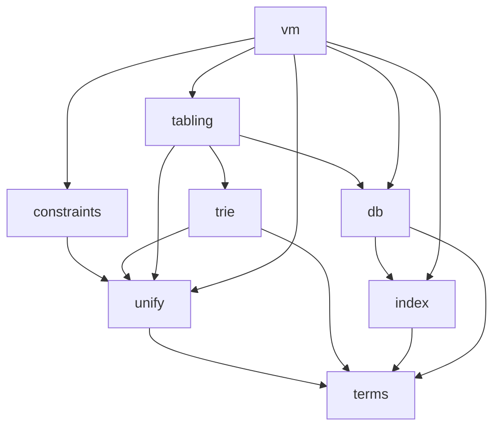

# LogicKernel architecture

## The rulebook: swipl-devel, as is

Decided 2026-10-03 (user): **LogicKernel follows swipl-devel as is — its logic, its data structures,
its semantics.** Where SWI uses a mechanism, the kernel uses that mechanism; a departure is a
`# DIVERGES:` with its reason, never a design preference. Two consequences that differ from Core:

* **Bindings use SWI's trail with marks.** Unification binds in a mutable binding store and records
  each binding on a trail; `Mark` before an attempt, `Undo` back to it afterwards — `pl-prims.c`'s
  `do_unify` and `pl-wam.c`'s `do_undo`, under upstream's names. The workspace's execution rules
  (sink/continuations, no choice points, no trail) govern **Core**, not the kernel's internals.
* **Grounded values unify by SWI's identity, not by `==`.** In the reference term type, `1 = 1.0`
  fails, `0.0 = -0.0` fails (floats compare by bit pattern), and a NaN unifies with an identical NaN.
  MeTTa's `==` matching belongs to Core's implementation of the term interface, which supplies its own
  `gnd_equal`/`gnd_key` — the separation the interface exists for.

## The layout mirrors swipl-devel

Decided 2026-10-02: LogicKernel is a **full mirror** of [swipl-devel](https://github.com/SWI-Prolog/swipl-devel)
(first priority) with [scryer-prolog](https://github.com/mthom/scryer-prolog) as the second reference,
so comparing with upstream — and tracking it commit by commit — stays a mechanical job.

| upstream | LogicKernel |
|---|---|
| swipl-devel `src/pl-prims.c` | `src/pl-prims.jl` |
| swipl-devel `boot/tabling.pl` | `boot/tabling.jl` |
| swipl-devel `tests/core_lang/test_bips.pl` | `test/core_lang/test_bips.jl` |
| swipl-devel `bench/programs/derive.pl` (the `bench` submodule, repo `swipl-bench`) | `bench/programs/derive.jl` |
| scryer-prolog `src/lib/tabling.pl` | `scryer-prolog/src/lib/tabling.jl` |

* A ported **file** lives at upstream's path; a ported **function** or **test unit** keeps upstream's
  name (`!` appended when it mutates an argument). Each carries a `# PORT:` marker.
* Code with **no upstream counterpart** opens with `# ORIGINAL: <why>` and lives in the nearest SWI
  area: `src/` for source, `test/<SWI tests area>/` for its tests, `test/` root for package
  infrastructure. It may never sit at a path that shadows an upstream file, and never in `boot/`.
* Directories exist only where swipl-devel has them.

`tools/port_check.jl` enforces every rule above in the suite (with a fixture proving each check can
fail), and the workspace hook `require-logickernel-port-header.sh` catches the common mistakes at
write time. The generated table in [`port_inventory.md`](port_inventory.md) lists every port;
`tools/upstream_drift.jl` reports what changed upstream since each one.

**Where Julia forces a different name** (the only deviations, each required by the language):

| swipl-devel | LogicKernel | why |
|---|---|---|
| `tests/` | `test/` | `Pkg.test` runs `test/runtests.jl` |
| `tests/test.pl` (driver) | `test/runtests.jl` | same |
| — | `src/LogicKernel.jl` | a package's entry file must be `src/<Name>.jl` |
| — | `ext/` | Julia package extensions |
| `doc/`, `man/` | `docs/` | Julia documentation convention |

Porting this way finds defects in swipl-devel itself; they are recorded in
[`upstream_reports.md`](upstream_reports.md) — LogicKernel issues first, reported upstream later.

## What is here now

| file | what | upstream |
|---|---|---|
| `src/term_interface.jl` | the term interface (ORIGINAL — settled 2026-10-02) | — |
| `src/pl-prims.jl` | the standard order of terms: `compareStandard` and its chain; UNIFICATION — `do_unify` (pair agenda, cyclic links), the `occurs_check` flag's three modes, `=`, `\=`, `unify_with_occurs_check/2`, `?=`, `unifiable/3`, and `resolve_term` to copy an answer out | `src/pl-prims.c`, `src/pl-incl.h` |
| `src/default_term.jl` | `Term{G}`, the reference implementation (ORIGINAL) | — |
| `test/core_lang/test_bips.jl` | SWI's own `ground/1`, `compare/3`, `==/2` tests | `tests/core_lang/test_bips.pl` |
| `test/core_lang/test_compare_swipl.jl` | live differential: `compare/3` on every pair vs `swipl` | — |
| `test/core_lang/test_term_interface.jl` | the conformance suite on the reference type | — |
| `bench/programs/{derive,nreverse,qsort,poly_10}.jl` | the STANDALONE CONSUMER: four of SWI's benchmark programs written on `DefaultTerm` with exported names only, beside the verbatim `.pl` files | swipl-bench `programs/*.pl` |
| `test/test_standalone_consumer.jl` | runs them: only exported names (checked by parsing), independent oracles, and identical `write_canonical` output to swipl running the upstream programs | — |
| `src/pl-index.jl` | just-in-time clause indexing, function by function: lookup, index creation, assessment, candidate indexes, the primary index, deep (list) indexes, the `indexed` property | `src/pl-index.c`, `src/pl-inline.h` |
| `src/pl-incl.jl` | the structs the clause store and its indexes are built from (`clause`, `clause_ref`, `clause_index`, `clause_list`, `definition`, …) and the word layout of keys | `src/pl-incl.h`, `src/pl-data.h` |
| `src/pl-comp.jl` | the head side of the clause compiler — variable analysis, `compileArgument`, the `H_VOID_N` merging — and the code readers the index uses (`skipArgs`, `argKey`) | `src/pl-comp.c`, `src/pl-comp.h` |
| `src/pl-vmi.jl` | the VM instructions heads compile to (declarations only) | `src/pl-vmi.c`, `src/pl-codetable.c` |
| `src/pl-proc.jl` | the clause database: predicates, assert with generations, retract (the logical update view), clause garbage collection, `retract/1`, `retractall/1` | `src/pl-proc.c`, `src/pl-proc.h` |
| `src/pl-global.jl` | the database state — upstream's GD and LD, as values the caller passes; LD holds the bindings, the trail and the `occurs_check` flag | `src/pl-global.h` |
| `src/pl-inline.jl` | clause visibility, the database generation, key cleaning; the binding primitives `deRef`, `Trail!`, `Mark`, `Undo!` | `src/pl-inline.h`, `src/pl-incl.h`, `src/pl-data.h` |
| `src/pl-thread.jl`, `src/pl-gc.jl` | the predicate references an enumeration registers, so clause GC keeps what it can still see | `src/pl-thread.c`, `src/pl-gc.c` |
| `src/pl-hash.jl` | MurmurHash2, for multi-argument keys and the term hashes | `src/pl-hash.c` |
| `src/pl-variant.jl` | `=@=` (`is_variant_ptr`): the argument agenda and the two-way variable correspondence | `src/pl-variant.c` |
| `src/pl-termwalk.jl` | the term agendas: the pre-order walk the variant digests use, the plain one `var_occurs_in` uses, the two-term one `do_unify` uses | `src/pl-termwalk.c` |
| `test/core_lang/test_unify.jl` | SWI's own `unify`, `can_compare` and `unifiable` units (rational trees included) but unify_fv and gc_1 | `tests/core_lang/test_unify.pl` |
| `test/core_lang/test_occurs_check.jl` | SWI's own occurs-check units in all three modes but the attributed-variable ones | `tests/core_lang/test_occurs_check.pl` |
| `test/rational/test_ieee754.jl` | SWI's identity and standard-order assertions on IEEE floats (`0.0 \== -0.0`, `nan == nan`, the order of NaN, ±Inf, ±0.0) | `tests/rational/test_ieee754.pl` |
| `test/core_lang/test_bindings.jl` | the trail (`Mark`/`Undo!`, marks nest), the unifier's divergences, `resolve_term`, and that a warm attempt allocates nothing | — |
| `test/core_lang/test_unify_swipl.jl` | live differential: `=/2` on 1500 hard random pairs in each `occurs_check` mode, outcomes and bindings identical to swipl's | — |
| `src/pl-termhash.jl` | `term_hash/2`, `variant_sha1/2`, `variant_hash/2`; Gladman's SHA-1 and the incremental MurmurHash — atoms hash by `sym_hash` and grounded values by `gnd_key`, so the digests are reproducible across processes but are not SWI's values | `src/pl-termhash.c`, `src/pl-termhash.h` |
| `test/core_lang/test_term.jl` | SWI's own `variant` (`=@=`) tests but the rational-tree and attvar ones | `tests/core_lang/test_term.pl` |
| `test/core_lang/test_hash.jl` | SWI's own `variant_sha1`, `variant_hash`, `term_hash2` tests (term_hash's pinned values as the properties they stand for) | `tests/core_lang/test_hash.pl` |
| `test/core_lang/test_termhash.jl` | SHA-1 against FIPS 180 and Julia's SHA stdlib, the kept `hash_compile` defect, digests identical in another process, digest equality ⇔ `=@=` on interface-only shapes | — |
| `test/core_lang/test_variant_swipl.jl` | live differential: `=@=` and the digests on 2000 random hard pairs vs swipl | — |
| `tools/bench.jl` | the per-chunk performance report: each primitive against swipl on the same terms (three runs, one process), then a profile of the worst | — |
| `test/db/test_jit.jl` | SWI's own JIT-indexing tests (`jit`, `jit_static`), every unit but the static-determinism checks of supervisors — on one shared `d/2`, as upstream | `tests/db/test_jit.pl` |
| `test/db/test_db.jl` | SWI's own `retract` and `retractall` tests that need no clause bodies, modules or threads | `tests/db/test_db.pl` |
| `test/db/test_update_view_gc.jl` | the logical update view under clause GC: an enumeration still sees a clause retracted and collected after it started — pinned and live against swipl | — |
| `test/db/test_index_swipl.jl` | the indexing contract, LogicKernel#1's fix pinned, and a live differential: random programs give identical answers to swipl for every call, and identical determinism, indexes and primary indexes wherever the fix cannot apply | — |
| `test/compile/test_head_code_swipl.jl` | live differential: compiled heads are instruction-for-instruction swipl's `vm_list` | — |

## Subsystems — a grouping of upstream files, not directories

The kernel is built in this order; each subsystem is the set of SWI files it ports. An arrow reads
"depends on".

| subsystem | port class | swipl-devel files | notes |
|---|---|---|---|
| `terms` | design + code | `src/pl-prims.c` (standard order) | the interface is ORIGINAL; compounds are children with the head as child 1 |
| `unify` | code | `src/pl-variant.c`, `src/pl-termhash.c`, unification in `src/pl-prims.c` | variant checking and term hashing ported 2026-10-03 (finite trees: no cycle marking, no attributed variables); unification ported 2026-10-03 as SWI's: a binding store and a trail with marks, the occurs-check modes, rational trees through bindings |
| `constraints` | code | `src/pl-attvar.c` | attributed-variable hooks |
| `trie` | code | `src/pl-trie.c` | answer and variant tables, variables keyed by first occurrence |
| `index` | code | `src/pl-index.c` | ported 2026-10-02, verbatim: keys are read from compiled head code as upstream reads them — with ONE deliberate divergence: `skipArgs`'s H_VOID_N defect is fixed ([LogicKernel#1](https://github.com/CognitiveSubstratesAI/LogicKernel/issues/1)), so an argument right after `_,_` is indexed where swipl 10.1.16 does not; see the contract below |
| `db` | code | `src/pl-proc.c` | clauses in source order, generations (logical update view), clause GC — ported 2026-10-02 with retract/1, retractall/1, clause/2; the unification they need is the caller's until `unify` is ported. Not yet: abolish, reload, transactions |
| `tabling` | code (WFS) | `src/pl-tabling.c`, `boot/tabling.pl`; scryer `src/lib/tabling.pl` | SLG: suspension, SCC completion, WFS delays; scryer's is the delimited-control design |
| `vm` | design | `src/pl-comp.c`, `src/pl-wam.c` | SWI is ZIP-based, not the WAM; compiled clauses decompile back to terms. The head side of pl-comp.c is ported (for the index); bodies and the instructions' execution are not |

## Invariants every subsystem keeps

1. **Indexing never changes answers.** Any narrowing yields a superset; enumeration yields exactly
   the true multiset, in source order. A flag that disables narrowing must disable EVERY narrowing.
   SWI's deep (list) indexes keep this by construction, so the port needs no extra step:
   `addClauseBucket` puts a variable clause into EVERY functor's clause list and starts each new
   list with the variable clauses already there, and `addClauseToIndex` refuses a variable clause
   into a list index (the index is dropped instead). An earlier note here, written before
   pl-index.c was read in full, claimed the opposite (corrected 2026-10-02).
2. **A grounded key follows the term type's `gnd_equal`** — SWI's identity in the reference type
   (`1` and `1.0`, `0.0` and `-0.0` unify apart and key apart); a type matching by `==` (Core's)
   keys by `==`. Where agreement cannot be guaranteed, the key is `nothing` — a wildcard, never a
   shared bucket. `gnd_equal` is the only grounded matching in the kernel.
3. **Answers in order, duplicates kept.** Deduplication and tabling modes are caller options.
4. **No module-level mutable state** (`tools/lint_globals.jl`, run by the suite).
5. **No runtime dispatch, no abstract fields, no `Any`** — enforced by the suite with JET, Aqua,
   AllocCheck and the type-discipline gates; every method must be in the dispatch manifest.
6. **Nondeterminism is sink/continuation with an explicit stack** (so far); **bindings follow SWI** — a
   binding store and a trail with marks, undone when an attempt's sink returns (see the rulebook
   above). Core's "no trail" rule does not govern the kernel's internals.
7. **Standalone.** No dependency on any CognitiveSubstratesAI package.

## Still to come

* ✅ **The standalone consumer** — done (four swipl-bench programs, above). It found a real gap on
  the way: a client could not read a symbol's NAME or a grounded VALUE through the public API, so
  `Term{G}` gained `sym_name` and `gnd_value` (the interface rightly has neither — the kernel never
  needs them). Each new subsystem extends the consumer with what it makes possible.
* ✅ **The clause database** — generations, retract, clause GC, `retract/1`, `retractall/1`,
  `clause/2` — done, with test_jit.pl's `remove`/`retract`/`retract2`/`clause` and test_db.pl's
  `retract`/`retractall` units.
* ✅ **Variant checking and term hashing** (`=@=`, `term_hash/2`, `variant_sha1/2`,
  `variant_hash/2`) — done 2026-10-03. Measured by `tools/bench.jl` on 8191-cell trees against
  swipl 10.1.16: `=@=` 0.2–0.4× swipl's time, `term_hash` 0.45×, `variant_sha1` 1.3–1.9×,
  `variant_hash` 1.5–2.1×. The variant digests' remaining cost is the variable-numbering map, which
  upstream does not pay — it overwrites each variable's cell in place, and interface terms cannot
  be marked.
* ✅ **Unification** (`=`, `\=`, `unify_with_occurs_check/2`, `?=`, `unifiable/3`, the `occurs_check`
  flag) — done 2026-10-03, SWI's design: bindings in a store with a trail, undone to a mark. Against
  swipl 10.1.16 on 8191-cell trees (`tools/bench.jl`): 2.4–5.5× swipl's time, no allocation. The
  first version linked every compound pair for cycle detection as upstream does and was 27–38×
  slower — the link is one pointer write upstream and an identity-map entry here — so only pairs
  reached through a binding are linked (DIVERGES in `do_unify`). The rest is the store itself: a
  `Dict` entry per binding where SWI writes a cell. The differential found a swipl abort in the
  occurs-check error path (`docs/tracking/repros/swipl_occurs_check_error_abort/` in the workspace).
  Next: retract/1, retractall/1 and clause/2 take the kernel's unification.
* **The canonical-encoding property** — the kernel's variant key of a term equals MORK's De Bruijn
  bytes for it. It arrives with variant canonicalisation (`unify`) and a PathMap extension.
