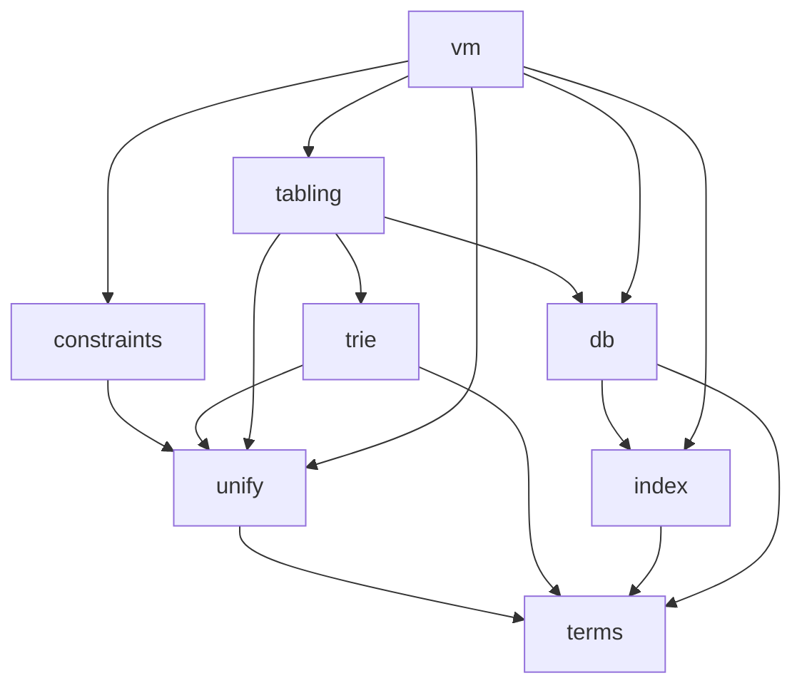

# LogicKernel architecture

## The rulebook: swipl-devel, as is

Decided 2026-10-03 (user): **LogicKernel follows swipl-devel as is — its logic, its data structures,
its semantics.** Where SWI uses a mechanism, the kernel uses that mechanism; a departure is a
`# DIVERGES:` with its reason, never a design preference. Two consequences that differ from Core:

* **Bindings use SWI's trail with marks.** Unification binds in a mutable binding store and records
  each binding on a trail; `Mark` before an attempt, `Undo` back to it afterwards — `pl-prims.c`'s
  `do_unify` and `pl-wam.c`'s `do_undo`, under upstream's names. The workspace's execution rules
  (sink/continuations, no choice points, no trail) govern **Core**, not the kernel's internals.
* **Grounded values unify by SWI's identity, not by `==`.** In the reference term type, `1 = 1.0`
  fails, `0.0 = -0.0` fails (floats compare by bit pattern), and a NaN unifies with an identical NaN.
  MeTTa's `==` matching belongs to Core's implementation of the term interface, which supplies its own
  `gnd_equal`/`gnd_key` — the separation the interface exists for.

## Commit messages follow SWI's categories

Decided 2026-10-03 (user), from that date on (history is not rewritten). Every commit message starts
with a category, as SWI-Prolog's history does, so the history can generate a changelog and match
ports against upstream:

* `ADDED:`, `FIXED:`, `ENHANCED:`, `MODIFIED:`, `DOC:`, `TEST:`, `CLEANUP:`.
* `UPSTREAM:` for a commit that ports or syncs code from swipl-devel (or scryer-prolog, swipl-bench).
  It names the upstream file(s), the functions and the upstream commit, e.g.
  `UPSTREAM: pl-wam.c PL_open_query/PL_next_solution (swipl-devel bae881a2)`. It is never `PORT:`,
  which in SWI means a platform port.

**Enforced by git itself** (since 2026-10-03): `tools/githooks/commit-msg` refuses a message without a
known prefix. Git hands it the final message file however the message was supplied, and it applies to
every committer. Install it once per clone with `git config core.hooksPath tools/githooks`;
`tools/run_tests.sh` refuses a full run without it. Its contract, both sides, is
`test/test_commit_msg_hook.jl`. It replaces a workspace-side check of the command text, which is now
retired.

## A full run of `tools/run_tests.sh` is the commit gate

Besides the suite, a FULL run first refuses to start unless:
* the commit-msg hook above is installed;
* the tree is Blue-formatted, checked as CI's Format job checks it (`format(".")` without writing),
  with the JuliaFormatter version CI pins — read from `.github/workflows/CI.yml`, so the two cannot
  drift.

So a formatting slip stops the commit locally instead of turning CI red afterwards. A single-file
run (`tools/run_tests.sh test/x.jl`) is for iteration and skips both checks; it is never evidence.

## The layout mirrors swipl-devel

Decided 2026-10-02: LogicKernel is a **full mirror** of [swipl-devel](https://github.com/SWI-Prolog/swipl-devel)
(first priority) with [scryer-prolog](https://github.com/mthom/scryer-prolog) as the second reference,
so comparing with upstream — and tracking it commit by commit — stays a mechanical job.

| upstream | LogicKernel |
|---|---|
| swipl-devel `src/pl-prims.c` | `src/pl-prims.jl` |
| swipl-devel `boot/tabling.pl` | `boot/tabling.jl` |
| swipl-devel `tests/core_lang/test_bips.pl` | `test/core_lang/test_bips.jl` |
| swipl-devel `bench/programs/derive.pl` (the `bench` submodule, repo `swipl-bench`) | `bench/programs/derive.jl` |
| scryer-prolog `src/lib/tabling.pl` | `scryer-prolog/src/lib/tabling.jl` |

* A ported **file** lives at upstream's path; a ported **function** or **test unit** keeps upstream's
  name (`!` appended when it mutates an argument). Each carries a `# PORT:` marker.
* Code with **no upstream counterpart** opens with `# ORIGINAL: <why>` and lives in the nearest SWI
  area: `src/` for source, `test/<SWI tests area>/` for its tests, `test/` root for package
  infrastructure. It may never sit at a path that shadows an upstream file, and never in `boot/`.
* Directories exist only where swipl-devel has them.

`tools/port_check.jl` enforces every rule above in the suite (with a fixture proving each check can
fail), and the workspace hook `require-logickernel-port-header.sh` catches the common mistakes at
write time. The generated table in [`port_inventory.md`](port_inventory.md) lists every port;
`tools/upstream_drift.jl` reports what changed upstream since each one.

**Where Julia forces a different name** (the only deviations, each required by the language):

| swipl-devel | LogicKernel | why |
|---|---|---|
| `tests/` | `test/` | `Pkg.test` runs `test/runtests.jl` |
| `tests/test.pl` (driver) | `test/runtests.jl` | same |
| — | `src/LogicKernel.jl` | a package's entry file must be `src/<Name>.jl` |
| — | `ext/` | Julia package extensions |
| `doc/`, `man/` | `docs/` | Julia documentation convention |

Porting this way finds defects in swipl-devel itself; they are recorded in
[`upstream_reports.md`](upstream_reports.md) — LogicKernel issues first, reported upstream later.

## What is here now

| file | what | upstream |
|---|---|---|
| `src/term_interface.jl` | the term interface (ORIGINAL — settled 2026-10-02) | — |
| `src/pl-prims.jl` | the standard order of terms: `compareStandard` and its chain; UNIFICATION — `do_unify` (pair agenda, cyclic links), the `occurs_check` flag's three modes, `=`, `\=`, `unify_with_occurs_check/2`, `?=`, `unifiable/3`, and `resolve_term` to copy an answer out | `src/pl-prims.c`, `src/pl-incl.h` |
| `src/default_term.jl` | `Term{G}`, the reference implementation (ORIGINAL) | — |
| `test/core_lang/test_bips.jl` | SWI's own `ground/1`, `compare/3`, `==/2` tests | `tests/core_lang/test_bips.pl` |
| `test/core_lang/test_compare_swipl.jl` | live differential: `compare/3` on every pair vs `swipl` | — |
| `test/core_lang/test_term_interface.jl` | the conformance suite on the reference type | — |
| `bench/programs/{derive,nreverse,qsort,poly_10}.jl` | the STANDALONE CONSUMER: four of SWI's benchmark programs written on `DefaultTerm` with exported names only, beside the verbatim `.pl` files | swipl-bench `programs/*.pl` |
| `test/test_standalone_consumer.jl` | runs them: only exported names (checked by parsing), independent oracles, and identical `write_canonical` output to swipl running the upstream programs | — |
| `src/pl-index.jl` | just-in-time clause indexing, function by function: lookup, index creation, assessment, candidate indexes, the primary index, deep (list) indexes, the `indexed` property | `src/pl-index.c`, `src/pl-inline.h` |
| `src/pl-incl.jl` | the structs the clause store and its indexes are built from (`clause`, `clause_ref`, `clause_index`, `clause_list`, `definition`, …) and the word layout of keys | `src/pl-incl.h`, `src/pl-data.h` |
| `src/pl-comp.jl` | the head side of the clause compiler — variable analysis, `compileArgument`, the `H_VOID_N` merging — and the code readers the index uses (`skipArgs`, `argKey`) | `src/pl-comp.c`, `src/pl-comp.h` |
| `src/pl-vmi.jl` | the VM instructions heads compile to (declarations only) | `src/pl-vmi.c`, `src/pl-codetable.c` |
| `src/pl-proc.jl` | the clause database: predicates, assert with generations, retract (the logical update view), clause garbage collection, `retract/1`, `retractall/1` | `src/pl-proc.c`, `src/pl-proc.h` |
| `src/pl-global.jl` | the database state — upstream's GD and LD, as values the caller passes; LD holds the bindings, the trail and the `occurs_check` flag | `src/pl-global.h` |
| `src/pl-inline.jl` | clause visibility, the database generation, key cleaning; the binding primitives `deRef`, `Trail!`, `Mark`, `Undo!` | `src/pl-inline.h`, `src/pl-incl.h`, `src/pl-data.h` |
| `src/pl-thread.jl`, `src/pl-gc.jl` | the predicate references an enumeration registers, so clause GC keeps what it can still see | `src/pl-thread.c`, `src/pl-gc.c` |
| `src/pl-hash.jl` | MurmurHash2, for multi-argument keys and the term hashes | `src/pl-hash.c` |
| `src/pl-variant.jl` | `=@=` (`is_variant_ptr`): the argument agenda and the two-way variable correspondence | `src/pl-variant.c` |
| `src/pl-termwalk.jl` | the term agendas: the pre-order walk the variant digests use, the plain one `var_occurs_in` uses, the two-term one `do_unify` uses | `src/pl-termwalk.c` |
| `test/core_lang/test_unify.jl` | SWI's own `unify`, `can_compare` and `unifiable` units (rational trees included) but unify_fv and gc_1 | `tests/core_lang/test_unify.pl` |
| `test/core_lang/test_occurs_check.jl` | SWI's own occurs-check units in all three modes but the attributed-variable ones | `tests/core_lang/test_occurs_check.pl` |
| `test/rational/test_ieee754.jl` | SWI's identity and standard-order assertions on IEEE floats (`0.0 \== -0.0`, `nan == nan`, the order of NaN, ±Inf, ±0.0) | `tests/rational/test_ieee754.pl` |
| `test/core_lang/test_bindings.jl` | the trail (`Mark`/`Undo!`, marks nest), the unifier's divergences, `resolve_term`, and that a warm attempt allocates nothing | — |
| `test/core_lang/test_unify_swipl.jl` | live differential: `=/2` on 1500 hard random pairs in each `occurs_check` mode, outcomes and bindings identical to swipl's | — |
| `src/pl-termhash.jl` | `term_hash/2`, `variant_sha1/2`, `variant_hash/2`; Gladman's SHA-1 and the incremental MurmurHash — atoms hash by `sym_hash` and grounded values by `gnd_key`, so the digests are reproducible across processes but are not SWI's values | `src/pl-termhash.c`, `src/pl-termhash.h` |
| `test/core_lang/test_term.jl` | SWI's own `variant` (`=@=`) tests but the rational-tree and attvar ones | `tests/core_lang/test_term.pl` |
| `test/core_lang/test_hash.jl` | SWI's own `variant_sha1`, `variant_hash`, `term_hash2` tests (term_hash's pinned values as the properties they stand for) | `tests/core_lang/test_hash.pl` |
| `test/core_lang/test_termhash.jl` | SHA-1 against FIPS 180 and Julia's SHA stdlib, the kept `hash_compile` defect, digests identical in another process, digest equality ⇔ `=@=` on interface-only shapes | — |
| `test/core_lang/test_variant_swipl.jl` | live differential: `=@=` and the digests on 2000 random hard pairs vs swipl | — |
| `tools/bench.jl` | the per-chunk performance report: each primitive against swipl on the same terms (three runs, one process), then a profile of the worst | — |
| `test/db/test_jit.jl` | SWI's own JIT-indexing tests (`jit`, `jit_static`), every unit but the static-determinism checks of supervisors — on one shared `d/2`, as upstream | `tests/db/test_jit.pl` |
| `test/db/test_db.jl` | SWI's own `retract` and `retractall` tests that need no clause bodies, modules or threads | `tests/db/test_db.pl` |
| `test/db/test_clause_variables.jl` | clause variables: renamed apart from the goal's, kernel keys unique across attempts and databases (a retained answer moves between databases), `var_term` rejecting the kernel's half, a sink's bindings gone after it — also when it throws | — |
| `test/db/test_update_view_gc.jl` | the logical update view under clause GC: an enumeration still sees a clause retracted and collected after it started — pinned and live against swipl | — |
| `test/db/test_index_swipl.jl` | the indexing contract, LogicKernel#1's fix pinned, and a live differential: random programs give identical answers to swipl for every call, and identical determinism, indexes and primary indexes wherever the fix cannot apply | — |
| `test/compile/test_head_code_swipl.jl` | live differential: compiled heads are instruction-for-instruction swipl's `vm_list`, frame-slot operands included (slots compacted past voids above the arity, 2026-10-03), with three hand-pinned heads and their frame sizes | — |
| `tools/githooks/commit-msg` | git's commit-msg hook: a commit message must start with a category (`ADDED:` … `UPSTREAM:`); installed with `git config core.hooksPath tools/githooks` | — |
| `test/test_commit_msg_hook.jl` | the commit-msg hook's contract, both sides (26 cases) | — |

## Subsystems — a grouping of upstream files, not directories

The kernel is built in this order; each subsystem is the set of SWI files it ports. An arrow reads
"depends on".

| subsystem | port class | swipl-devel files | notes |
|---|---|---|---|
| `terms` | design + code | `src/pl-prims.c` (standard order) | the interface is ORIGINAL; compounds are children with the head as child 1 |
| `unify` | code | `src/pl-variant.c`, `src/pl-termhash.c`, unification in `src/pl-prims.c` | variant checking and term hashing ported 2026-10-03 (finite trees: no cycle marking, no attributed variables); unification ported 2026-10-03 as SWI's: a binding store and a trail with marks, the occurs-check modes, rational trees through bindings |
| `constraints` | code | `src/pl-attvar.c` | attributed-variable hooks |
| `trie` | code | `src/pl-trie.c` | answer and variant tables, variables keyed by first occurrence |
| `index` | code | `src/pl-index.c` | ported 2026-10-02, verbatim: keys are read from compiled head code as upstream reads them — with ONE deliberate divergence: `skipArgs`'s H_VOID_N defect is fixed ([LogicKernel#1](https://github.com/CognitiveSubstratesAI/LogicKernel/issues/1)), so an argument right after `_,_` is indexed where swipl 10.1.16 does not; see the contract below |
| `db` | code | `src/pl-proc.c` | clauses in source order, generations (logical update view), clause GC — ported 2026-10-02 with retract/1, retractall/1, clause/2, which unify with the kernel's unification since 2026-10-03 (`decompileHead!`: the stored head copied with fresh kernel variable keys per attempt — an INTERIM divergence until the VM runs compiled heads against frame slots). Not yet: abolish, reload, transactions |
| `tabling` | code (WFS) | `src/pl-tabling.c`, `boot/tabling.pl`; scryer `src/lib/tabling.pl` | SLG: suspension, SCC completion, WFS delays; scryer's is the delimited-control design |
| `vm` | design | `src/pl-comp.c`, `src/pl-wam.c` | SWI is ZIP-based, not the WAM; compiled clauses decompile back to terms. The head side of pl-comp.c is ported (for the index); bodies and the instructions' execution are not |

## Invariants every subsystem keeps

1. **Indexing never changes answers.** Any narrowing yields a superset; enumeration yields exactly
   the true multiset, in source order. A flag that disables narrowing must disable EVERY narrowing.
   SWI's deep (list) indexes keep this by construction, so the port needs no extra step:
   `addClauseBucket` puts a variable clause into EVERY functor's clause list and starts each new
   list with the variable clauses already there, and `addClauseToIndex` refuses a variable clause
   into a list index (the index is dropped instead). An earlier note here, written before
   pl-index.c was read in full, claimed the opposite (corrected 2026-10-02).
2. **A grounded key follows the term type's `gnd_equal`** — SWI's identity in the reference type
   (`1` and `1.0`, `0.0` and `-0.0` unify apart and key apart); a type matching by `==` (Core's)
   keys by `==`. Where agreement cannot be guaranteed, the key is `nothing` — a wildcard, never a
   shared bucket. `gnd_equal` is the only grounded matching in the kernel.
3. **Answers in order, duplicates kept.** Deduplication and tabling modes are caller options.
4. **No module-level mutable state** (`tools/lint_globals.jl`, run by the suite).
5. **No runtime dispatch, no abstract fields, no `Any`** — enforced by the suite with JET, Aqua,
   AllocCheck and the type-discipline gates; every method must be in the dispatch manifest.
6. **SWI's execution model inside the kernel; the caller's sink at the boundary** (user, 2026-10-03).
   The VM is ported as is — frames, choice points and the trail included — and bindings follow SWI:
   a binding store and a trail with marks. Answers leave the kernel through upstream's own query API
   (`PL_open_query`/`PL_next_solution`/`PL_cut_query`/`PL_close_query`, pl-wam.c), with a sink (and an
   iterator) as thin conveniences on top; until the VM lands, retract/1, retractall/1 and clause/2
   call a sink per answer and undo its bindings when it returns. Core's execution rules (no choice
   points, no trail) govern Core, not the kernel's internals.
7. **Standalone.** No dependency on any CognitiveSubstratesAI package.

## The VM — five design decisions (DECIDED 2026-10-03 — audited by the user)

Invariant 6 decided the model: SWI's frames, choice points and trail inside the kernel, upstream's
query API at the boundary. These five decisions say HOW (COMPILER_PLAN 3h). The user audited them
against `pl-vmi.c`, `pl-wam.c`, `pl-inline.h` and `pl-comp.c` at `bae881a2` and approved them, with
the answers and conditions in § "Decided answers and conditions" at the end of this section — those
take precedence over the text above them where they differ. The inventory, the measurement and the step plan (V1–V9) are in
[`port_inventory.md`](port_inventory.md) § "The VM". Each decision cites upstream at `bae881a2`:
`wam:` = `src/pl-wam.c`, `vmi:` = `src/pl-vmi.c`, `c:` = `src/pl-comp.c`, `incl:` = `src/pl-incl.h`.

### Decision 1 — the boundary is upstream's query API, nested queries included

* **Ported as is, under upstream's names:** `PL_open_query`, `PL_next_solution`, `PL_cut_query`,
  `PL_close_query`, `PL_exception` (wam:2882-3258).
* **Query setup, as upstream:**
  * a `queryFrame` with a dummy `top_frame`;
  * the real frame, whose return address is the one-instruction clause `I_EXITQUERY` built at start-up
    (`initVM`, wam:3790);
  * an embedded `CHP_TOP` choice point holding the query's `Mark`.
* **Flags kept:** `PL_Q_NORMAL`, `PL_Q_NODEBUG`, `PL_Q_CATCH_EXCEPTION`, `PL_Q_PASS_EXCEPTION`,
  `PL_Q_EXT_STATUS`. **Not ported:** the yield, halt and thread-exit flags.
* **Return protocol, upstream's integers:** `TRUE`, `FALSE`, `PL_S_LAST` (a deterministic last answer
  under `EXT_STATUS`), `PL_S_EXCEPTION`, `PL_S_NOT_INNER`.
* **`qid_t`:** the position of the query frame on the local stack, checked by a magic field as upstream
  checks it. Upstream mallocs a `{engine, offset}`; this kernel has one engine.
* **Answers:** an answer is read from the bindings while it is current. Two rules carry over:
  * calling `PL_next_solution` again after a deterministic last answer undoes it (wam:3653-3659);
  * `PL_cut_query` keeps the bindings and `PL_close_query` undoes them — unless the query ended in an
    exception it passes on (`qf->exception && PL_Q_PASS_EXCEPTION`, wam:3159). That is the only
    difference between the two.
* **Nested queries, upstream's rules:**
  * queries form a stack (`LD->query`, `qf->parent`);
  * only the innermost query may be advanced, cut or closed — anything else returns `PL_S_NOT_INNER`
    (wam:3110, 3144, 3650);
  * a query opens only inside an open foreign frame (asserted, wam:2904-2905), which the CALLER provides —
    a built-in runs inside its own (`vmi_fopen`), and `callCleanupHandler` opens one (wam:834, 879). A
    built-in that calls back into Prolog does what `call1`/`call_term` do (wam:737-806): open a query with
    `PL_Q_PASS_EXCEPTION` or `PL_Q_CATCH_EXCEPTION`, take one solution, cut it.
* **Exceptions crossing Julia (DIVERGES — the only one in this decision):** upstream's `PL_throw` longjmps
  to a `setjmp` in `PL_next_solution` (wam:3551-3580).
  * Here, built-ins raise the way most upstream built-ins already do: `PL_raise_exception` plus a `FALSE`
    return.
  * `PL_next_solution` holds the one `try`/`catch` — the `setjmp`'s place. It turns the kernel's own
    `PL_throw` exception type into the `b_throw` path.
  * Any other Julia exception (a bug, an interrupt) restores the query to closed and is rethrown, never
    swallowed.
  * The ball must survive `Undo`. Upstream freezes the global stack under it (`freezeGlobal`,
    pl-fli.c:4757; `frozen_bar`, wam:1569). Here the ball is resolved through the bindings when it is
    raised (`resolve_term`), so it no longer depends on the binding store.
* **`# ORIGINAL` conveniences on top, nothing more:**
  * a sink — `f(ld)` is called for each answer while its bindings are live; returning `false` cuts the
    query;
  * a do-block iterator that yields RESOLVED answers (`resolve_term`) and closes the query however the
    block exits. A plain Julia iterator cannot know when it is abandoned.
* **The existing sink-based `retract/1`, `retractall/1` and `clause/2`** stay as they are until V9. There
  they become what they are upstream: non-deterministic foreign predicates.

### Decision 2 — the data model: immutable terms, a binding store, and mutable frame slots

SWI builds terms cell by cell on a mutable global stack. A variable is a cell, and a binding is a write
to that cell (trailed when the cell is older than the newest choice point). The kernel has:

* **immutable terms** (the interface; `mk_expr` takes a finished children vector);
* **variables as keys**, bound in `LD.bindings` and recorded on the trail — every binding trailed, as
  today;
* **mutable frame slots:** the local stack's cells, each holding a term.

Writing a slot is not a binding, and upstream does not trail it either (vmi:741-747, 1607-1628).

| instruction family | upstream (cells) | kernel |
|---|---|---|
| frame slots (arguments = slots `0..arity-1`, then clause variables) | words after the frame header, `argFrameP`/`varFrameP` (incl:1192-1202) | positions on the local stack: `slots::Vector{T}`, each a term (an unbound variable is a `VAR` term) |
| head, READ mode (`H_ATOM`, `H_SMALLINT`, `H_NIL`, `H_FUNCTOR`, `H_LIST`, …) | `deRef(ARGP)`, compare the cell; descend with `ARGP = argTermP` | `deRef` through the store; compare by IDENTITY (`sym_key`, `gnd_equal`, head + arity); descend with a cursor `(term, child index)` |
| head, WRITE mode (the caller's argument is unbound) | allocate `f(_,…,_)` on the global stack, bind the argument to it (trailed), then later `H_*` fill the cells in place, untrailed (vmi:782-812). `H_VAR` in write mode COPIES only under `occurs_check=false`; otherwise it unifies the slot with the cell, against the argument ALREADY bound to the partial term (vmi:680-736) | **under `occurs_check=false`, a builder:** later `H_*`/`B_*` write children into a scratch frame, and the closing `H_POP` (or the end of an `R`-chain) builds `mk_expr` and binds the argument (trailed). That is observably the same as binding first: `p(X, f(X))` called as `p(A, A)` gives `A = f(A)` both ways. **Under `true`/`error` it is NOT** — swipl fails `p(A,A)` (`true`), and for `p3(X,Y,f(Y,X))` called as `p3(A,A,A)` raises `occurs_check(_A,f(_A,_B))` (`error`), which a late bind would report as `occurs_check(A,f(A,A))`. So at write-mode entry the builder reads `LD.prolog_flag_occurs_check` as vmi:680 does: under `true`/`error` it takes upstream's order for that compound — `mk_expr` with fresh-variable children, bind the argument (trailed), then `pl_unify!` each `H_VAR` child. The builder state is reset on `CLAUSE_FAILED`, as `unify_backtrack` resets `aTop` (vmi:6467-6469); trailing voids the compiler omits (`f(a,g(_))` ends in `h_rfunctor(g/1) h_pop`) become fresh variables. **For your audit.** |
| body arguments (`B_ATOM`, `B_SMALLINT`, `B_NIL`, `B_VAR*`, `B_ARGVAR`, `B_FUNCTOR`, `B_LIST`, `B_POP`, …) | `*ARGP++ = cell`, straight into the next frame's argument cells above `lTop` (vmi:1783), or into a compound being built | slot writes above `lTop`; compounds through the same builder |
| first occurrences (`H_FIRSTVAR`, `B_FIRSTVAR`, `B_ARGFIRSTVAR`, `B_VOID`) | `H_FIRSTVAR` in READ mode stores the caller's child in the slot (vmi:755); otherwise a fresh global cell, or `setVar` of a cell, with the slot pointing at it | read mode: the caller's child, stored in the slot; otherwise a fresh variable key (`fresh_var_keys!`) stored in the slot (and in the child being built) |
| variable reads (`B_VAR`, `B_ARGVAR`, `H_VAR` in write mode) | `linkValI`, `globaliseVar`, and **binding direction chosen by address** (`k > ARGP`, `ARGP < k`; vmi:683, 1050) | `deRef(slot)` copied. **The address rules disappear:** they exist because a global cell may not point into the local stack, and keyed variables live in neither stack |
| `H_VAR` in read mode, `B_UNIFY_*` | `do_unify`/`unify_ptrs` (pl-prims.c) | `pl_unify!` — already ported |
| constants (`H_ATOM`, `B_ATOM`, …) | the operand IS the atom or the small integer | the operand indexes a per-clause **literal table** (`Vector{T}`): `B_ATOM` PUTs the term and `H_ATOM` compares by identity. `argKey` derives the index key from the literal (`sym_hash`/`gnd_key`, as today), so the indexes do not change. This replaces today's hash operand, which cannot be decompiled and is not identity — for `H_FUNCTOR`/`B_FUNCTOR` too (`B_FUNCTOR` must construct the head symbol). Only symbols and small integers become `B_ATOM`/`B_SMALLINT` literals: floats, big integers and strings keep `B_FLOAT`/`B_MPZ`/`B_STRING`, which are not `VIF_LCO`, so `lco()` (c:3744) refuses them as upstream does (needs Q1) |
| LCO (`L_VAR`, `L_*`, `copyFrameArguments`) | raw copies between a frame's own cells (vmi:2415; wam:2410) | slot copies — safe for the same reason as upstream: nothing refers INTO a slot |
| choice point `Mark` | `{trailtop, globaltop, saved_bar}`; `Undo` resets the trail and `gTop` (wam:1538-1578) | `{trailtop}`; `Undo!` deletes the trailed keys from the store. Julia's GC reclaims what `gTop` would |
| trail elision (`LD->mark_bar`) | a GLOBAL cell newer than the newest choice point is not trailed; a local-stack cell always is (pl-inline.h:536-543) | **not ported — every binding is trailed** (the existing `Trail!` DIVERGES). A key has no age that `Undo` could truncate, so an untrailed binding would leave a stale store entry after backtracking: a leak, not a wrong answer |
| `term_t` (decision 5) | a word offset into the local stack (incl:2213) | a slot position |

**Where a flat term store would change this:**
* write mode would fill cells in place, so no builder;
* a `Mark` would regain `globaltop`, and `Undo` would truncate the store — which brings back `mark_bar`
  trail elision;
* constants would be cells;
* building a compound would be a bump allocation instead of a `Vector` per `mk_expr`.

The instruction semantics, frames, choice points and query API above are independent of that choice.

### Decision 3 — frames and choice points: vector-backed stacks, integer positions

* **One position space, as upstream's one local stack.**
  * `lTop::Int`.
  * A frame and a choice point each record their `base` position.
  * `FR`, `BFR` and `parent` are integer indices into `LD.frames` / `LD.choices` (vectors of concrete
    immutable records: `localFrame{T}` with `programPointer` as clause + index, `parent`, `clause`,
    `predicate`, `generation`, `level`, `flags`; `choice` with `type`, `parent`, `mark`, `frame` and the
    `ClauseChoice` or the jump target).
* **Every age test upstream makes by address compares `base` positions** (`BFR <= FR`, `fr <= ch`,
  `FR > catcher`; wam:2040, 2624; vmi:2039, 2174, 2398, 2575, 5127). Frames are reused by LCO and popped
  by an exit, so this is a stack HEIGHT, not a timestamp — the same as upstream.
* **Upstream's stack moves, carried over:**
  * a deterministic exit sets `lTop` to the frame's base and drops the records above it (vmi:2174-2179);
  * LCO reuses the frame record in place (vmi:2036-2077);
  * the `memmove` of a `CHP_CLAUSE` choice point to just above the next clause's variables (vmi:6503-6507)
    becomes an update of its `base`.
* **Registers and state, as upstream splits them.** `FR`, `NFR`, `ARGP`, `DEF`, `PC` are run-loop
  locals (wam:3323-3350). `BFR` is NOT a register: it is `LD->choicepoints` (wam:76). `CL` is
  `FR->clause` (wam:3334). `environment_frame` is written on every call and exit (vmi:1879, 2194),
  because built-ins and nested queries read it (wam:2953, 2980-2982). The kernel keeps `BFR`,
  `environment_frame` and `lTop` in `LD` — or syncs them before every foreign call.
* **FliFrames and query frames are records in the same position space.** FliFrames (`fli_context`,
  `{size, mark, parent}`) are compared with frames by address (wam:2904, 2968, 3247; pl-fli.c:537-568;
  vmi:4425, 4503, 5139), and a query's `choice` sits below its `top_frame` and `frame`
  (pl-incl.h:1911-1916). **Every** assignment that lowers `lTop` drops the records above it, not only a
  deterministic exit: `I_CUT` (vmi:2591), shallow and deep backtracking (vmi:6490, 6520, 6618),
  `restore_after_query` (wam:3086).
* **Allocation:**
  * the stacks are pre-sized at `PL_local_data` creation;
  * `growLocalSpace` (upstream's name) is the ONLY allocating path;
  * the AllocCheck gate checks the call, exit and supervisor paths and admits allocation sites only
    inside it;
  * a warmed run at capacity must allocate nothing on those paths, apart from the compounds the program
    builds;
  * upstream raises `resource_error` at the stack limit (vmi:1886-1890). That needs V5's exception path;
    until then, a limit on `growLocalSpace` raises a Julia error rather than letting runaway recursion
    exhaust memory.

### Decision 4 — determinism detection, ported with the run loop

Upstream's own mechanisms, as is:

* **No choice point when there is no alternative:**
  * `S_TRUSTME` for a single clause, and `S_LIST` for a `[]`/`[_|_]` pair, which dispatches without the
    index;
  * `S_STATIC` creates `CHP_CLAUSE` only when `firstClause` leaves a candidate (vmi:3362-3381);
  * shallow backtracking pops the choice point BEFORE the last alternative runs (vmi:6520-6525).
* **Deterministic exit:** `I_EXIT` with `BFR <= FR` pops the frame (`lTop = FR`, vmi:2174-2179).
* **Last-call frame reuse:**
  * `I_DEPART`'s LCO (`BFR <= FR`, the `last_call` flag and a defined target, vmi:2039-2042;
    `copyFrameArguments`);
  * the compiler's in-place block `L_NOLCO …; I_TCALL | I_LCALL` (vmi:2380-2557; c:3715-3812).
* **`I_CUT`:** a no-op when `BFR <= FR`, otherwise `discardChoicesAfter` (vmi:2572-2598).

Measured above: for the bench's calls (first argument always a bound list), `nreverse` runs on
`S_TRUSTME` and `S_LIST` alone, so it creates no clause choice point. `S_LIST` falls into `S_STATIC` on an
unbound argument (vmi:3605-3608): `concatenate(A,B,[1])` is non-deterministic, as in swipl.

**The gate:**
* (a) `concatenate/3` on lists of 10³, 10⁴ and 10⁵ elements reaches the same local-stack high-water mark;
* (b) a failure-driven loop of `nreverse` returns the trail, the binding store and both stacks to their
  baseline on every iteration;
* (c) determinism per answer (`PL_S_LAST`) equals swipl's on every differential query.

### Decision 5 — the built-in interface: upstream's foreign-predicate protocol, Julia functions

* **Calling convention:** a built-in is a Julia function with upstream's signature —
  `pl_<fname><arity>_va(ld, PL__t0::term_t, PL__ac::Int, PL__ctx::control_t)::foreign_t`, where `fname` is
  upstream's C name (`unify`, `variant`, …; `PRED_SHARE` gives `pl_<fname>va_va`, as for `clause/2`) —
  with a `# PORT:` marker. `A1`…`An` are `PL__t0 + i`, and **`term_t` is a slot position, so a
  built-in's handles ARE its frame's argument slots** (vmi:4319, 4350).
* **The FLI it needs is ported from pl-fli.c under upstream's names** and works on `(ld, term_t)`:
  `PL_new_term_ref(s)`, `PL_get_*`, `PL_put_*`, `PL_unify_*`. Upstream's built-in bodies (`is/2` at
  pl-arith.c:4772: `valueExpression(A2)`, then `PL_unify_number(A1)`) then port nearly line for line.
* **Registration as upstream:** `PRED_DEF` tables (`PL_predicates_from_<file>`), `registerBuiltins` at
  `PL_global_data` creation (pl-ext.c:302-563), and `createForeignSupervisor` giving
  `I_FCALLDETVA <f>` for a `PRED_DEF` built-in (pl-supervisor.c:143-182). The FRG table
  (pl-ext.c:96-190) is not VARARGS and gets `I_FCALLDET<N>, I_FEXITDET`.
* **Dispatch (DIVERGES — the reason is invariant 5):** upstream stores a C function pointer in the
  operand.
  * A Julia function stored in a container is called by DYNAMIC dispatch, which the zero-dispatch gate
    rejects.
  * So the system tables are compiled into ONE generated dispatcher: an `if`/`elseif` over the table index
    whose every branch is a static call.
  * The operand is the table index.
  * User registration (`PL_register_foreign`) is deferred until a consumer needs it, and will need its
    own typed design.
* **Return protocol, upstream's `I_FEXITDET`:** `TRUE` exits, `FALSE` fails — or throws if an exception
  is pending — and any other value is a domain error (vmi:4422-4442).
* **Non-deterministic built-ins** (V9) use upstream's sequence `I_FOPENNDET, I_FCALLNDET*, I_FEXITNDET,
  I_FREDO`:
  * a `CHP_JUMP` choice point and `control_t` with `FRG_FIRST_CALL`/`FRG_REDO`/`FRG_CUTTED`;
  * the redo context kept in the frame's own field rather than overloading `clause` (upstream tags it into
    `FR->clause`, vmi:4647);
  * `REDO_INT` contexts first. `REDO_PTR` needs a typed context store, designed when the first such
    built-in is ported.
* **First users:**
  * the ALREADY-PORTED predicates, registered as upstream registers them (V5): pl-prims.c's table
    (pl-prims.c:6570-6623) and `=@=` (pl-variant.c:544);
  * then pl-arith.c (V6);
  * then `clause/2` and `retract/1`, which upstream implements as non-deterministic foreign predicates
    (V9).

### The questions put to the user (answered below)

The read surfaced three things the settled term interface cannot express. Each changes what the
compiler can emit.

1. **Q1 — reserved symbols and numbers.**
   * **What upstream needs:**
     * the compiler dispatches on reserved symbols — `,` `;` `->` `*->` `\+` `!` `true` `fail` `call` `is`
       `=` `==`, `[]` and `'[|]'` (c:2465-2652, 3474-3560);
     * the choice of instructions depends on them: `H_NIL`/`B_NIL`, `H_LIST`/`H_LIST_FF`/`B_LIST`,
       `H_SMALLINT`/`B_SMALLINT`, `S_LIST`, `A_ADD_FC`;
     * built-ins need number values and constructors (`is/2` builds its result; type tests like
       `I_INTEGER`; errors build `error(type_error(…), …)`).
   * **What the interface has:** no symbol constructor, no grounded constructor and no number access —
     only `mk_var` and `mk_expr`.
   * **Proposal:** a small Prolog layer in the interface, `# ORIGINAL`:
     * `mk_sym(T, name)` and `mk_gnd(T, v)`;
     * one numeric accessor for integers and floats;
     * the reserved symbols built once per `PL_global_data`.

     Without it, the compiler emits `B_ATOM`/`B_FUNCTOR` for `[]` and lists. That changes no answer and
     no LCO decision (both are LCO-able, or both are not). But it loses `H_LIST_FF` and `S_LIST` — so
     `nreverse` would run on `S_STATIC` with indexing — and poly_10 cannot get `A_ADD_FC`. And `is/2`,
     type tests and error terms cannot be written at all.
2. **Q2 — compounds whose head is not a symbol** (MeTTa's variable and compound heads; SWI has none).
   * **Today:** they compile as `H_FUNCTOR 0` with every child as an argument (`src/pl-comp.jl:382`). That
     is enough for the index, but **unsound to execute** (no arity check) and cannot be decompiled.
   * **Proposal:** a reserved functor `$expr/n`, where `n = nchildren`, whose arguments are all the
     children, the head included — `# DIVERGES`, since SWI has no such terms.
3. **Q3 — the builder in write mode** (decision 2). The proposal is BOTH, chosen by the `occurs_check`
   flag, as upstream itself branches on it (vmi:680): the builder under `false` (the default, and the hot
   path), and upstream's order under `true`/`error` — `mk_expr` with fresh-variable children first, bind
   the argument, then unify each `H_VAR` child — because only that order gives swipl's failures and error
   terms there (verified by probe, decision 2). The alternative is upstream's order always: one store
   entry and one trail entry per cell, and longer `deRef` chains, on every write-mode compound.

### Decided answers and conditions (user, 2026-10-03)

**Q1 — a small Prolog layer in the interface: APPROVED**, on two conditions:
* **SWI-7's `[]`, exactly.** `[]` is a reserved constant distinct from the atom `'[]'` (`[] == '[]'` is
  false), and lists are `'[|]'/2`. Pinned with SWI's own tests for `[]` and `'[|]'`, not with
  assumptions.
* **The numeric accessor preserves the KIND** — small integer, big integer, float (and rational if
  ported) — because SWI's instruction choice (`H_SMALLINT` / `H_MPZ` / `H_FLOAT`) and the standard order
  depend on it.

**Q2 — a reserved `$expr/n` functor: APPROVED**, marked `# DIVERGES`. Its standard-order position is
defined explicitly: with the other compounds, by arity then name, as `compareStandard` already orders
them. It stays OUT of the swipl differentials (SWI cannot express it) and has its own tests.

**Q3 — the builder under `false`, upstream's order under `true`/`error`: APPROVED.** Upstream confirms the
split: under `false`, `H_VAR` in write mode copies (or trails a local-stack variable to the new cell) and
continues; otherwise it falls through to `do_unify`/`unify_ptrs` against the already-bound structure.
Two additions:
* the builder is a **stack** (write mode nests — an `H_FUNCTOR` inside a structure being built) and is
  reset on every `CLAUSE_FAILED`;
* the three-mode differential extends to **head unification** in V4a: random clause heads called with
  random goals under all three `occurs_check` modes, comparing bindings, failures and error terms with
  swipl.

**Condition 1 — memory outside the local stack.** Upstream keeps deterministic programs small two ways:
trail elision (`Trail()` skips global cells newer than `mark_bar`) and garbage collection of the global
stack. The kernel trails every binding and shrinks the binding store only by backtracking to a mark, so
a long deterministic run (`concatenate/3` on 10⁵ elements, an agent loop) grows the trail and the store
linearly even with a flat local stack — and a local-stack gate cannot see it.
* Trail length and store size join the flatness measurements, so the growth is VISIBLE and measured.
* **Design item, recorded now: a binding-store collector** — the analogue of `pl-gc.c`'s marking from
  frames and choice points — designed before any long-running workload uses the VM.
* Correction to decision 2's reasoning: a key DOES have an age. Kernel-issued keys come from a monotonic
  counter, so a key's value is its age, and a choice point can record the counter at creation. That
  makes `mark_bar`-style elision possible — but an untrailed binding then needs the collector to reclaim
  its entry. Both routes lead to the same collector; which one is decided when it is designed.

**Condition 2 — decision 5's dispatch: typed function pointers are a candidate.** Every built-in has the
same signature, so a `FunctionWrappers.jl`-style typed wrapper (one concrete type per term type `T`)
stores a callable pointer in a table without dynamic dispatch — what upstream does with C function
pointers. It would make `PL_register_foreign` the same mechanism instead of a deferred separate design,
and avoid one very large generated function. V5 measures both (call overhead, JET, compile latency) and
takes the faster one that passes the zero-dispatch gate.

**Condition 3 — registers mirror upstream's `SAVE_REGISTERS`/`LOAD_REGISTERS` exactly.** Of decision 3's
two options, the second: run-loop locals for speed, written back to `LD` and reloaded at exactly the
places upstream calls `SAVE_REGISTERS(QID)`/`LOAD_REGISTERS(QID)`, under those names — so the port stays
line-for-line comparable and a missing sync shows as a missing macro.

**Condition 4 — V9 is split** into separate steps, each with its own gate, when it is reached.

## Still to come

* ✅ **The standalone consumer** — done (four swipl-bench programs, above). It found a real gap on
  the way: a client could not read a symbol's NAME or a grounded VALUE through the public API, so
  `Term{G}` gained `sym_name` and `gnd_value` (the interface rightly has neither — the kernel never
  needs them). Each new subsystem extends the consumer with what it makes possible.
* ✅ **The clause database** — generations, retract, clause GC, `retract/1`, `retractall/1`,
  `clause/2` — done, with test_jit.pl's `remove`/`retract`/`retract2`/`clause` and test_db.pl's
  `retract`/`retractall` units.
* ✅ **Variant checking and term hashing** (`=@=`, `term_hash/2`, `variant_sha1/2`,
  `variant_hash/2`) — done 2026-10-03. Measured by `tools/bench.jl` on 8191-cell trees against
  swipl 10.1.16: `=@=` 0.2–0.4× swipl's time, `term_hash` 0.45×, `variant_sha1` 1.3–1.9×,
  `variant_hash` 1.5–2.1×. The variant digests' remaining cost is the variable-numbering map, which
  upstream does not pay — it overwrites each variable's cell in place, and interface terms cannot
  be marked.
* ✅ **Unification** (`=`, `\=`, `unify_with_occurs_check/2`, `?=`, `unifiable/3`, the `occurs_check`
  flag) — done 2026-10-03, SWI's design: bindings in a store with a trail, undone to a mark. Against
  swipl 10.1.16 on 8191-cell trees (`tools/bench.jl`): 2.4–5.5× swipl's time, no allocation. The
  first version linked every compound pair for cycle detection as upstream does and was 27–38×
  slower — the link is one pointer write upstream and an identity-map entry here — so only pairs
  reached through a binding are linked (DIVERGES in `do_unify`). The rest is the store itself: a
  `Dict` entry per binding where SWI writes a cell. The differential found a swipl abort in the
  occurs-check error path (`docs/tracking/repros/swipl_occurs_check_error_abort/` in the workspace).
  ✅ retract/1, retractall/1 and clause/2 use it (2026-10-03): a mark per candidate clause, the
  answer's bindings live while the caller's sink runs, undone after it (in a `finally`: ≲ 0.1 µs).
  Variable keys: a caller owns those below 2^63 (`var_term` checks), the kernel takes its own from
  one process-wide counter. `clause/2` over 1000 facts: 0.55× swipl's time. Found on the way and
  fixed next: `nextClause!` allocated an `index_context` per call (upstream: the C stack); it now
  resets one scratch context in the local data and is gated allocation-free.
* **The canonical-encoding property** — the kernel's variant key of a term equals MORK's De Bruijn
  bytes for it. It arrives with variant canonicalisation (`unify`) and a PathMap extension.
